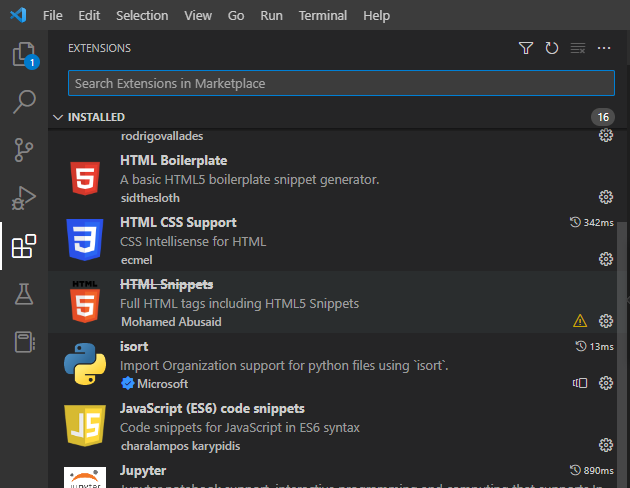
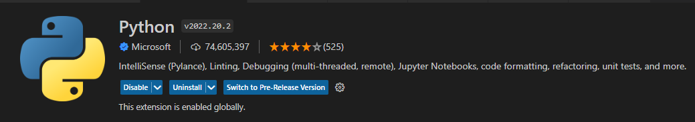
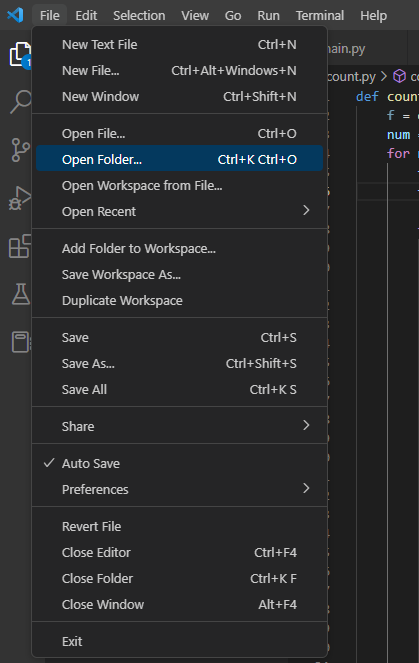
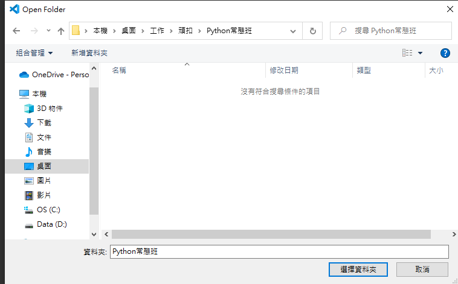
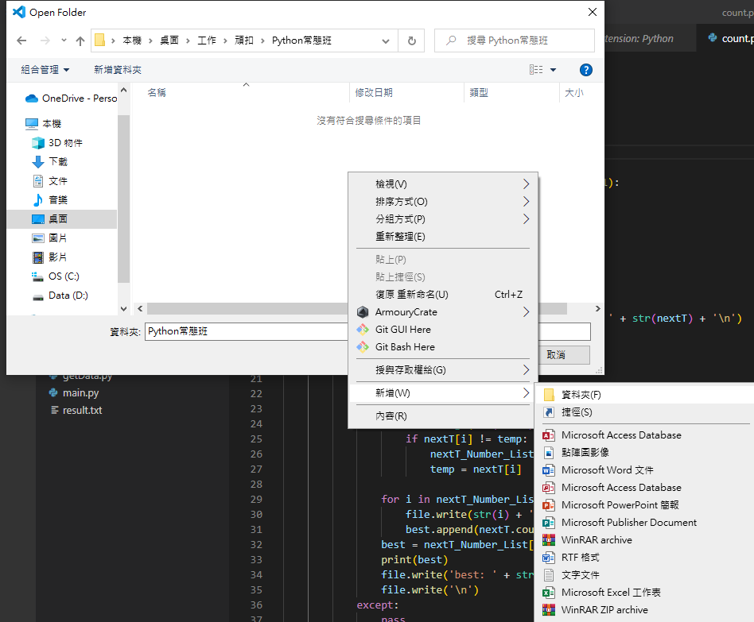
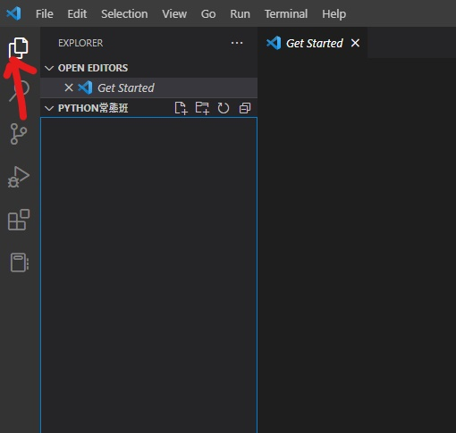
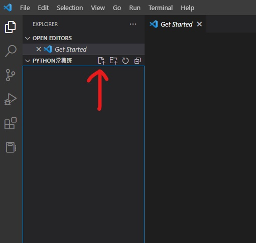
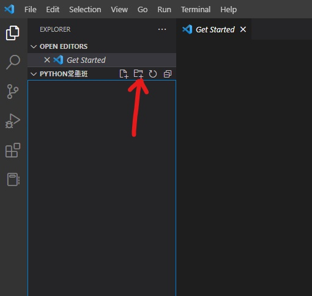

# Lesson 0 環境設置、課程介紹 Environment Setup

> 這堂課的重點：把寫 Python 需要的工具安裝好，並學會 VS Code 最基本的檔案管理、終端機操作與常用快捷鍵。

---

## Section I. 今天要做什麼？

這堂課不是正式開始寫很多程式，而是先把之後上課會用到的工具準備好。  
如果環境沒有設定好，後面寫程式時很容易遇到「明明程式沒錯，但電腦不能執行」的問題。

今天會完成以下事情：

1. 安裝 Python。
2. 安裝 VS Code。
3. 在 VS Code 安裝 Python Extension。
4. 學會開啟課程資料夾。
5. 學會建立 `.py` 檔案。
6. 學會使用終端機執行 Python 檔案。
7. 認識常用副檔名與快捷鍵。

---

## Section II. 安裝 Python

Python 是我們這門課會使用的程式語言。  
安裝 Python 之後，電腦才知道要怎麼執行 Python 程式。

### Step 1. 下載 Python 3

請依照自己的電腦系統下載安裝檔。

| 系統 | 下載位置 |
| --- | --- |
| Windows | Python 官網 Windows 下載頁 |
| macOS | Python 官網 macOS 下載頁 |
| 其他系統 | Python 官網 |

> 課堂提醒：請下載 **Python 3**，不要下載 Python 2。

### Step 2. 執行安裝檔

下載完成後，打開安裝檔，依照預設設定安裝即可。

> Windows 重要提醒：如果安裝畫面有看到 **Add Python to PATH**，請記得勾選。  
> 如果沒有勾選，之後在終端機輸入 `python` 時可能會找不到 Python。

<!-- comment: 這裡之後可以補 Python 安裝畫面截圖，特別標出 Add Python to PATH。 -->

### Step 3. 確認 Python 是否安裝成功

安裝完成後，可以打開終端機，輸入：

```bash
python --version
```

如果看到類似下面的結果，代表安裝成功：

```text
Python 3.x.x
```

有些電腦需要輸入：

```bash
python3 --version
```

---

## Section III. 安裝 VS Code

VS Code 是我們用來寫程式、管理檔案與執行程式的工具。  
你可以把 VS Code 想成「寫程式用的筆記本」，但是它比一般記事本更適合寫程式。

### Step 1. 下載 VS Code 安裝檔

請依照自己的電腦系統下載安裝檔。

| 系統 | 下載位置 |
| --- | --- |
| Windows | VS Code 官網 Windows 下載頁 |
| macOS | VS Code 官網 macOS 下載頁 |

### Step 2. 執行安裝檔

下載完成後，打開安裝檔，使用預設設定安裝即可。

### Step 3. 安裝 Python Extension

打開 VS Code 後，請依照以下步驟安裝 Python Extension：

1. 點擊左側的 **Extensions / 套件** 圖示。
2. 在搜尋欄輸入 `Python`。
3. 找到 Microsoft 提供的 Python Extension。
4. 按下 **Install**。



如果已經安裝成功，畫面可能會顯示 **Disable** 或 **Uninstall**，代表 Python Extension 已經啟用。



> 課堂提醒：VS Code 是編輯器，Python 是程式語言。  
> 只安裝 VS Code 還不夠，還需要安裝 Python 和 Python Extension。

---

## Section IV. 基本操作：檔案管理

寫程式前，建議先建立一個專門放課程檔案的資料夾。  
例如：

```text
Python_常態班
```

之後每堂課的程式都可以放在這個資料夾裡。

---

### 1. 開啟資料夾

在 VS Code 上方選單點選：

```text
File → Open Folder
```



接著選擇你想要存放課程檔案的資料夾，最後按下 **選擇資料夾**。



---

### 2. 建立新的課程資料夾

如果還沒有資料夾，也可以在選擇資料夾視窗中按右鍵，建立新資料夾。



建議資料夾名稱可以清楚一點，例如：

```text
Python_常態班
```

或：

```text
Python_Lesson
```

---

### 3. 認識 Explorer 檔案視窗

開啟資料夾後，可以從左側的 **Explorer / 檔案總管** 查看目前資料夾中的檔案。



Explorer 是之後最常用的地方之一，可以用來：

1. 查看目前資料夾中的檔案。
2. 建立新的程式檔。
3. 建立新的資料夾。
4. 開啟已經存在的檔案。

---

### 4. 建立新檔案

在左側 Explorer 中，點擊 **New File** 圖示可以建立新檔案。



檔案名稱需要加上副檔名，例如：

```text
example.py
```

`.py` 代表這是一個 Python 程式檔。

> 常見錯誤：  
> 如果你把檔案命名成 `example`，但沒有加上 `.py`，電腦可能不會把它當成 Python 程式。

---

### 5. 建立新資料夾

在左側 Explorer 中，點擊 **New Folder** 圖示可以建立新資料夾。



建議可以依照課程建立資料夾，例如：

```text
lesson_0
lesson_1
lesson_2
```

這樣之後找檔案會比較清楚。

---

### 6. 常用副檔名

副檔名通常放在檔案名稱的最後面，用來告訴電腦這是什麼類型的檔案。

| 副檔名 | 意義 | 例子 |
| --- | --- | --- |
| `.txt` | 文字檔 | `note.txt` |
| `.py` | Python 程式檔 | `example.py` |
| `.exe` | Windows 執行檔 | `setup.exe` |
| `.zip` | 壓縮檔 | `images.zip` |
| `.ipynb` | Jupyter Notebook 檔案 | `lesson.ipynb` |
| `.md` | Markdown 文件 | `README.md` |

---

## Section V. 基本操作：終端機 Terminal

終端機可以想像成「用文字指令操作電腦」的地方。  
我們會用它來進入資料夾、執行 Python 程式。

---

### 1. 開啟終端機

在 VS Code 上方選單點選：

```text
Terminal → New Terminal
```

開啟後，下方會出現一個可以輸入指令的區域。

<!-- comment: 這裡之後可以補 Terminal → New Terminal 的截圖。 -->

---

### 2. 管理終端機

終端機右上方通常會有以下按鈕：

| 按鈕 | 用途 |
| --- | --- |
| `+` | 新增一個終端機 |
| 垃圾桶 | 關閉目前的終端機 |

如果終端機畫面太亂，可以按垃圾桶關掉，再重新開一個新的終端機。

---

### 3. 選擇資料夾：`cd`

`cd` 可以讓終端機進入指定資料夾。

```bash
cd 資料夾名稱
```

例如：

```bash
cd lesson_0
```

回到上一層資料夾：

```bash
cd ../
```

> 小提醒：終端機目前在哪個資料夾，就會從那個資料夾找檔案。  
> 如果終端機位置錯了，就可能出現「找不到檔案」的錯誤。

---

### 4. 查看目前資料夾中的檔案

在 Windows 中，可以輸入：

```bash
dir
```

在 macOS 或 Linux 中，可以輸入：

```bash
ls
```

這可以幫助你確認目前資料夾裡有沒有你要執行的 `.py` 檔案。

---

### 5. 執行 Python 檔案

假設目前資料夾中有一個檔案叫做 `example.py`，可以輸入：

```bash
python example.py
```

有些電腦需要使用：

```bash
python3 example.py
```

如果 `python example.py` 不能執行，可以試試看 `python3 example.py`。

---

## Section VI. 第一個 Python 程式

請在 VS Code 建立一個檔案：

```text
example.py
```

接著輸入以下程式：

```python
print("Hello Python")
```

在終端機執行：

```bash
python example.py
```

如果成功，畫面會出現：

```text
Hello Python
```

---

### 小練習：改成自己的名字

把程式改成：

```python
print("My name is Ying")
```

你也可以把 `Ying` 改成自己的名字。

---

## Section VII. 常用快捷鍵

快捷鍵可以讓寫程式更快。  
一開始不用全部背起來，先記常用的幾個就好。

### 1. 複製、貼上

| 功能 | Windows | macOS |
| --- | --- | --- |
| 複製 | `Ctrl + C` | `Command + C` |
| 貼上 | `Ctrl + V` | `Command + V` |

---

### 2. 選取

| 功能 | Windows | macOS |
| --- | --- | --- |
| 一般選取 | `Shift + 方向鍵` | `Shift + 方向鍵` |
| 選取下一個相同文字 | `Ctrl + D` | `Command + D` |

---

### 3. 還原

| 功能 | Windows | macOS |
| --- | --- | --- |
| 還原 | `Ctrl + Z` | `Command + Z` |

---

### 4. 移動整行程式

| 功能 | Windows | macOS |
| --- | --- | --- |
| 上下移動一行 | `Alt + 方向鍵` | `Option + 方向鍵` |

---

### 5. 註解

註解可以暫時讓某一行程式不被執行，也可以用來寫說明。

| 功能 | Windows | macOS |
| --- | --- | --- |
| 註解 / 取消註解 | `Ctrl + /` | `Command + /` |

Python 註解會長這樣：

```python
# 這一行是註解，不會被執行
print("這一行會被執行")
```

---

## Section VIII. 視窗管理

### 1. 開啟檔案視窗

在左側 **Explorer / 檔案總管** 中，點選任意檔案，就可以在中間開啟編輯視窗。

### 2. 分割視窗

如果想要同時看兩個檔案，可以使用 VS Code 的分割視窗功能。  
這在一邊看範例、一邊寫練習時很方便。

<!-- comment: 這裡之後可以補 VS Code 分割視窗按鈕截圖。 -->

---

## Section IX. 常見問題

### Q1. 我輸入 `python example.py`，但終端機說找不到檔案？

可能原因是終端機目前不在 `example.py` 所在的資料夾。

解決方式：

1. 先確認 `example.py` 放在哪個資料夾。
2. 用 `cd` 進入正確資料夾。
3. 再執行：

```bash
python example.py
```

---

### Q2. 我輸入 `python`，但電腦說找不到指令？

可能原因：

1. Python 沒有安裝成功。
2. Windows 安裝時沒有勾選 **Add Python to PATH**。
3. 你的電腦需要使用 `python3` 指令。

可以試試：

```bash
python3 example.py
```

---

### Q3. 為什麼檔案一定要叫 `.py`？

因為 `.py` 會告訴電腦：「這是一個 Python 程式檔」。  
如果只叫 `example` 或 `example.txt`，VS Code 和 Python 可能不會把它當成 Python 程式。

---

### Q4. VS Code 和 Python 是同一個東西嗎？

不是。

| 工具 | 功能 |
| --- | --- |
| Python | 負責執行 Python 程式 |
| VS Code | 負責寫程式、管理檔案、開終端機 |
| Python Extension | 讓 VS Code 更好地支援 Python |

---

### Q5. 終端機指令打錯怎麼辦？

可以重新輸入一次。  
也可以使用方向鍵 `↑` 找到上一個輸入過的指令，再修改它。

---

## Section X. 重點複習

| 重點 | 說明 |
| --- | --- |
| Python | 用來執行 Python 程式的工具 |
| VS Code | 用來寫程式與管理檔案的編輯器 |
| Python Extension | 讓 VS Code 更好地支援 Python |
| `.py` | Python 程式檔的副檔名 |
| Terminal | 用文字指令操作電腦的地方 |
| `cd` | 進入資料夾 |
| `cd ../` | 回到上一層資料夾 |
| `dir` | Windows 查看目前資料夾檔案 |
| `ls` | macOS / Linux 查看目前資料夾檔案 |
| `python 檔名.py` | 執行 Python 檔案 |

---

## Section XI. 課堂練習

### Q1. 建立課程資料夾

建立一個資料夾，名稱可以叫：

```text
Python_常態班
```

或：

```text
Python_Lesson
```

---

### Q2. 用 VS Code 開啟資料夾

在 VS Code 中點選：

```text
File → Open Folder
```

並開啟剛剛建立的課程資料夾。

---

### Q3. 建立 Python 檔案

在資料夾中建立一個檔案：

```text
example.py
```

---

### Q4. 寫出第一個程式

在 `example.py` 中輸入：

```python
print("Hello Python")
```

---

### Q5. 用終端機執行程式

在終端機輸入：

```bash
python example.py
```

如果不能執行，改試：

```bash
python3 example.py
```

---

### Q6. 修改輸出文字

把程式改成輸出自己的名字，例如：

```python
print("My name is Ying")
```

---

### Q7. 建立 lesson_0 資料夾

在 Explorer 中建立一個資料夾：

```text
lesson_0
```

之後可以把 Lesson 0 的練習檔案放進去。

---

## Section XII. 小測驗

### Q1. `.py` 代表什麼檔案？

A. 文字檔  
B. Python 程式檔  
C. 壓縮檔  
D. 圖片檔  

---

### Q2. 在 VS Code 中要安裝 Python Extension，應該點左側哪一個功能？

A. Explorer  
B. Search  
C. Extensions  
D. Source Control  

---

### Q3. 如果想要執行 `example.py`，可以在終端機輸入什麼？

A. `run example.py`  
B. `open example.py`  
C. `python example.py`  
D. `start python`  

---

### Q4. `cd ../` 的功能是什麼？

A. 建立新檔案  
B. 回到上一層資料夾  
C. 執行 Python  
D. 關閉終端機  

---

### Q5. 如果 Windows 安裝 Python 時沒有勾選 Add Python to PATH，可能會發生什麼事？

A. VS Code 不能開啟  
B. 終端機可能找不到 python 指令  
C. 電腦不能上網  
D. 檔案會消失  

---

## 隱藏答案區

> Answer hidden - try it first.
>
> Q1: B
>
> Q2: C
>
> Q3: C
>
> Q4: B
>
> Q5: B
