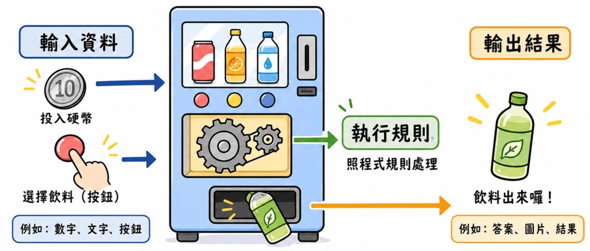
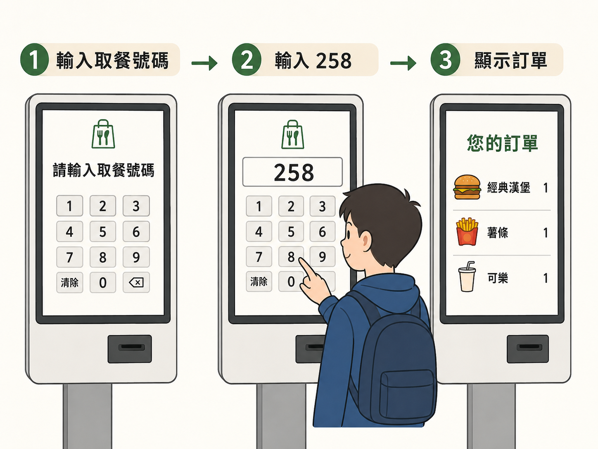

# Lesson 1 輸入輸出 Input & Output

把程式想像成一台自動販賣機：你投入硬幣與按鈕，機器照規則處理，最後吐出飲料。

<p align="center">
  
</p>

程式也是一樣：

> 輸入資料 → 執行規則 → 輸出結果
> 

---

---

## Section I. 什麼是程式？

寫程式就像設計一台會照規則工作的機器。

這台機器通常會經過三個步驟：

| 步驟 | 名稱 | 說明 |
| --- | --- | --- |
| 1 | 輸入 Input | 使用者給資料，例如名字、年齡、成績。 |
| 2 | 處理 Process | 程式按照你寫好的規則計算或判斷。 |
| 3 | 輸出 Output | 程式把結果顯示出來，例如問候語、答案、分數。 |

**生活例子：**

點飲料時，你告訴店員「我要一杯珍珠奶茶、半糖、去冰」，這些就是輸入；

店員依照規則製作飲料，就是處理；

最後拿到飲料，

就是輸出。

<p align="center">
  
</p>

---

## Section II. 輸出函式 `print()`

`print()` 的功能是讓電腦把內容顯示在終端機或執行畫面上。

```python
print(輸出內容)
```

### 1. 輸出文字

如果要輸出一段文字，要用單引號或雙引號包起來，讓 Python 知道這是「文字」。

```python
print('HelloWorld')
print("早安")
```

**生活例子：**

就像你在 LINE 打一句話，文字需要被當成訊息處理，而不是數學算式。

### 2. 輸出數字

數字不需要加引號，Python 會直接把它當成數字。

```python
print(123)
print(3.14)
```

### 3. 輸出算數結果

Python 可以直接幫我們做簡單的數學運算。

```python
print(123 + 456)
print(10 * 5)
```

輸出結果會是計算後的答案，而不是原本的算式文字。

### 4. 一次輸出多個內容

`print()` 裡可以放多個內容，中間用逗號隔開。

Python 預設會在中間加一個空格。

```python
print(123, '早安')
```

可能輸出：

```
123 早安
```

### 5. 分隔符號 `sep`

`sep` 用來指定多個輸出內容中間要用什麼符號隔開。

`sep` 是 separator 的縮寫，意思是「分隔符號」。

```python
print(1, 2, 3, 4, 5, sep=',')
print('台北', '台中', '高雄', sep=' -> ')
```

**生活例子：**

如果你想把早餐清單印成「蛋餅/奶茶/水果」，就可以把 `sep` 設成斜線。

```python
print('蛋餅', '奶茶', '水果', sep='/')
```

### 6. 結尾符號 `end`

每一次 `print()` 結束時，Python 預設會自動換行。

`end` 可以改變結尾要接的內容。

```python
print(123)
print(456)
```

上面的程式會分成兩行輸出，因為 `print()` 的預設結尾是換行符號 `\n`。

```python
print(123, end=' ')
print(456)
```

這樣 `123` 和 `456` 會比較像接在同一行。

---

## Section III. 輸入函式 `input()`

<p align="center">
  
</p>

`input()` 的功能是讓程式等待使用者輸入資料。

括號內可以放提示文字，提醒使用者要輸入什麼。

```python
input('提示文字')
```

### 1. 獲取輸入

如果直接把 `input()` 放進 `print()`，程式會先等你輸入，再把你輸入的內容印出來。

```python
print(input())
```

更清楚的寫法是先把輸入存到變數中，再輸出。

```python
name = input('請輸入你的名字：')
print('你好', name)
```

**生活例子：**

自助點餐機問你「請輸入取餐號碼」，你輸入後，機器才能顯示你的訂單。

### 2. `input()` 得到的內容都是文字

要特別注意：`input()` 讀進來的內容預設都是文字。

就算你輸入 `12`，Python 也會先把它當成「文字 12」，不是數字 `12`。

> **常見錯誤提醒**
> 
> 
> 如果要拿輸入的數字做加減乘除，之後會需要用 `int()` 或 `float()` 轉型。
> 

### 3. 輸入分割 `split()`

如果同一行輸入有多個資料，可以用 `split()` 把它切開。預設會用空格切割。

```python
data = input().split()
print(data)
```

例如使用者輸入：

```
小明 13 台北
```

`split()` 會把它拆成三份資料。

拆開後的結果會是一個串列 List，之後會在 Lesson 3 或 Lesson 9 更詳細說明。

```python
name, age, city = input('請輸入名字 年齡 城市：').split()
print(name, age, city)
```

---

## Section IV. 完整小範例

### 範例 1：讓使用者輸入名字，程式輸出問候語

```python
name = input('請輸入你的名字：')
print('Hello', name)
```

### 範例 2：讓使用者輸入三樣想吃的食物，並用逗號輸出

```python
food1 = input('第一樣食物：')
food2 = input('第二樣食物：')
food3 = input('第三樣食物：')
print(food1, food2, food3, sep=', ')
```

### 範例 3：把同一行輸入的兩個字拆開

```python
first, second = input('請輸入兩個詞，中間用空格隔開：').split()
print('第一個詞：', first)
print('第二個詞：', second)
```

---

## Section V. 重點複習

| 語法 | 用途 |
| --- | --- |
| `print(內容)` | 輸出內容到畫面。 |
| `print(a, b, c)` | 一次輸出多個內容，預設中間有空格。 |
| `sep='符號'` | 改變多個輸出中間的分隔符號。 |
| `end='符號'` | 改變 `print()` 結束後接的內容，預設是換行。 |
| `input('提示文字')` | 讓使用者輸入資料，結果預設是文字。 |
| `input().split()` | 把同一行輸入依空格切開。 |

---

## Section VI. 課堂練習

- Q1. 詢問使用者的名字，並輸出使用者的名字。
- Q2. 輸出 1 到 5，中間用逗號隔開。
- Q3. 讓使用者輸入名字，輸出「hello 名字」。
- Q4. 讓使用者輸入兩個單字，並分別輸出第一個與第二個。

---

---

---

## 隱藏答案區

> Answer hidden - try it first.
> 
> 
> Answer hidden - try it first.
>