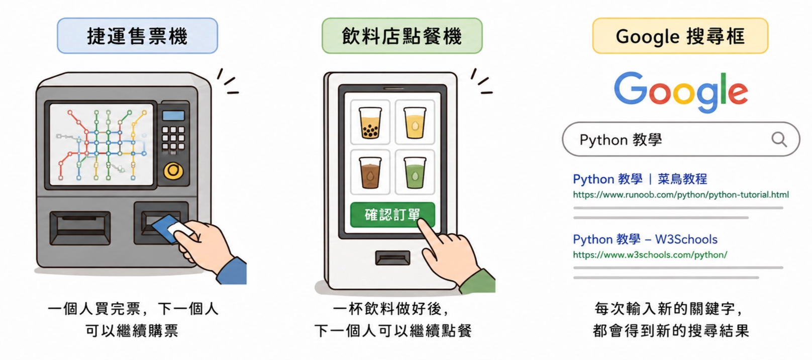

# Lesson 1 延伸：連續輸入｜Python 基礎

---

## 核心概念

在日常生活中，很多機器或程式都不是只服務一個人就結束。

例如捷運售票機、飲料店點餐機、Google 搜尋框，都是一次接一次接收新的輸入。

<p align="center">
  
</p>

`input()` 很適合單次互動；如果題目要求「不知道會輸入幾行資料」，就常會使用連續輸入。

| 概念 | 意思 | 生活化例子 |
| --- | --- | --- |
| `input()` | 讀取一次輸入 | 老師問一題，學生回答一次 |
| `sys.stdin` | 從系統標準輸入中連續讀取資料 | 點餐機一直等待下一位客人點餐 |
| `for` 迴圈 | 重複執行同一段程式 | 考卷一題一題檢查答案 |

---

## 什麼是連續輸入

連續輸入就是：程式不只讀一次資料，而是可以一行一行地讀很多次。

常見的線上程式題會把多筆資料一次丟給程式，所以我們要讓程式能一直接收，直到輸入結束。

<p align="center">
  
</p>

生活化理解：

飲料店點餐機不會只讓第一位客人點餐就關機，而是會一直等待下一位客人輸入品項。

連續輸入的程式也有類似想法：

> 每收到一行資料 → 處理一次
> 

---

## 引入 `sys` module

`module` 可以想成「工具箱」。

Python 本身已經有很多內建工具，但有些功能需要先把工具箱拿出來。

`sys` 是和系統操作相關的工具箱，這裡我們用它來讀取標準輸入。

```python
import sys
```

`import` 的意思是「引入」。

當我們需要使用某個函式庫時，就可以使用 `import`。

---

## 使用 `stdin` 達成連續輸入

`sys.stdin` 可以讓程式從標準輸入中讀取資料。

搭配 `for` 迴圈後，每次迴圈會拿到一行輸入，暫時放在變數 `i` 裡。

```python
import sys

for i in sys.stdin:
    i = int(i)
```

上面這段程式會把每一行輸入轉成整數。

注意：如果輸入的是文字，例如 `hello`，`int(i)` 會出錯，因為 `hello` 不能變成整數。

---

## 範例 1：連續輸入字串並直接輸出

題目：連續輸入一行字串，並直接輸出該字串。

這類題目常見於練習「讀到什麼，就印出什麼」。

```python
import sys

for line in sys.stdin:
    print(line, end="")
```

為什麼要加 `end=""`？

因為 `line` 本身通常已經包含換行符號。

如果 `print()` 再自動換行一次，輸出中間就可能多出空白行。

---

## 常見錯誤

- 忘記縮排：`for` 迴圈下面的程式碼要往右縮排。
- 把文字拿去 `int()`：只有數字字串才能轉成整數。
- 輸出多空行：`print(line)` 可能多換一行，可改成 `print(line, end="")`。
- 不知道何時停止：在終端機中，連續輸入通常到 EOF 才結束；線上評測系統會自動提供結束。

---

## 重點複習

| 觀念 | 說明 |
| --- | --- |
| 連續輸入 | 適合處理「很多行資料」或「不知道有幾筆資料」的題目。 |
| `sys` | Python 的系統工具箱，要先 `import sys`。 |
| `for line in sys.stdin:` | 會一行一行讀取輸入。 |
| `print(line, end="")` | 可以避免輸出原字串時產生多餘換行。 |

---

## 課後練習

- Q1b：連續輸入一行字串，並直接輸出該字串。檔名：`Q1b.py`
- 加分練習：連續輸入多行數字，把每一行轉成整數後輸出它的兩倍。
- 想一想：如果輸入中有空白，例如 `bubble tea`，程式會如何輸出？

---