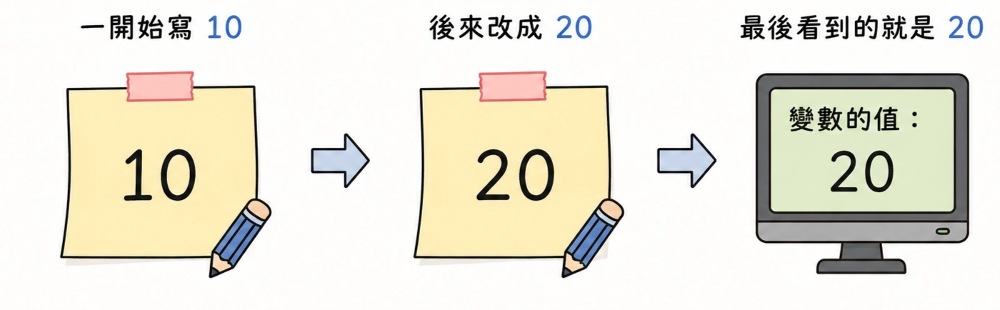
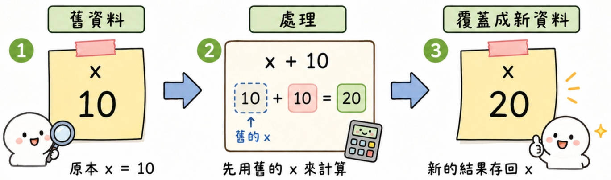

# Lesson_3_序列_Sequence

---

## Section I. 什麼是序列 Sequence

程式在執行時，會有固定的執行順序。

一般來說，Python 會依照：

> 由左而右 → 由上而下
> 

的順序執行程式。

也就是說，程式會先執行前面的內容，再執行後面的內容。

---

## Section II. 變數覆蓋

變數就像一張便條紙。



如果你一開始在便條紙上寫 `10`，後來又把它改成 `20`，那電腦最後看到的就是 `20`。

### 範例 Ex.7：判斷 `x` 輸出後的結果

```python
x = 10
x = 20
print(x)
```

執行結果：

```
20
```

生活化理解：

一開始 `x` 裡面放的是 `10`。

但是第二行又把 `x` 改成 `20`。

所以最後 `print(x)` 看到的是最新的資料，也就是 `20`。

---

## Section III. 用新結果覆蓋舊資料

藉由程式會由上而下執行的特性，可以先拿舊的資料來計算，再把計算後的新結果存回同一個變數。



也就是：

> 舊資料 → 處理 → 覆蓋成新資料
> 

這在程式中非常常見。

例如：

```python
x = 10
x = x + 5
print(x)
```

執行結果：

```
15
```

這裡的 `x = x + 5` 不是數學中的等式，而是程式中的「指定」。

意思是：先拿出原本的 `x`，加上 `5`，再把結果重新放回 `x`。

---

## Section IV. 括號與優先執行

另外，使用括號時，括號內的內容會先執行完畢。

這個特性在數學運算中很常見，也同樣適用於函式。

例如：

```python
print((2 + 3) * 4)
```

因為括號內的 `2 + 3` 會先執行，所以結果是：

```
20
```

如果沒有括號：

```python
print(2 + 3 * 4)
```

Python 會先算乘法，所以結果是：

```
14
```

> 補充提醒：這個性質之後會在大師班階段的「遞迴」單元再次使用。
> 

---

## Section V. 完整小範例

### 範例 Ex.8：輸入數字後處理並輸出

將使用者輸入的數字存於變數 `x` 中，接著將 `x * 10 - 3` 後輸出。

```python
x = int(input())
x = x * 10 - 3
print(x)
```

如果使用者輸入：

```
5
```

程式會先把 `5` 存進 `x`。

接著執行：

```python
x = x * 10 - 3
```

也就是：

```
5 * 10 - 3 = 47
```

最後輸出：

```
47
```

生活化理解：

這就像飲料店先記下杯數，再依照公式計算總價或折扣後的價格。

---

## Section VI. 常見錯誤

- 以為 `x = x + 1` 是數學等式；在程式中，它的意思是「把舊的 `x` 加 1 後，再存回 `x`」。
- 忘記程式是由上而下執行，導致誤判最後輸出的結果。
- 忘記 `input()` 讀進來的是字串，如果要做數學計算，要先用 `int()` 或 `float()` 轉型。
- 忽略括號的優先順序，導致計算結果和自己預期不同。

---

## Section VII. 重點複習

| 觀念 | 說明 |
| --- | --- |
| 序列 Sequence | 程式會按照順序執行。 |
| 執行方向 | 通常由左而右、由上而下。 |
| 變數覆蓋 | 後面的指定會覆蓋前面的值。 |
| 更新變數 | 可以用舊資料計算後，再存回同一個變數。 |
| 括號 | 括號內的內容會先執行。 |

---

## Section VIII. 課堂練習

- Q1. 判斷下面程式最後會輸出什麼：

```python
x = 3
x = 8
print(x)
```

- Q2. 判斷下面程式最後會輸出什麼：

```python
x = 5
x = x + 2
print(x)
```

- Q3. 讓使用者輸入一個數字，將它加上 `10` 後輸出。
- Q4. 讓使用者輸入一個數字，將它乘以 `2` 後再減 `1`，最後輸出結果。
- Q5. 比較下面兩段程式的輸出結果有什麼不同：

```python
print((2 + 3) * 4)
```

```python
print(2 + 3 * 4)
```

---

## Section IX. 課後練習

### 改名字

請寫一個程式，先建立一個變數 `name`，放入自己的名字。

接著把 `name` 改成另一個名字，最後輸出 `name`。

範例：

```python
name = '小明'
name = '小華'
print(name)
```

想一想：最後輸出的會是第一個名字，還是第二個名字？為什麼？

---