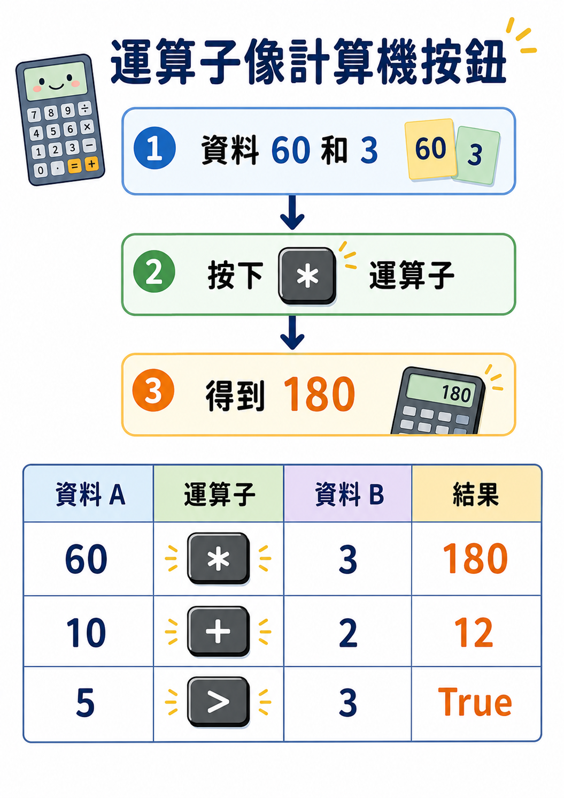
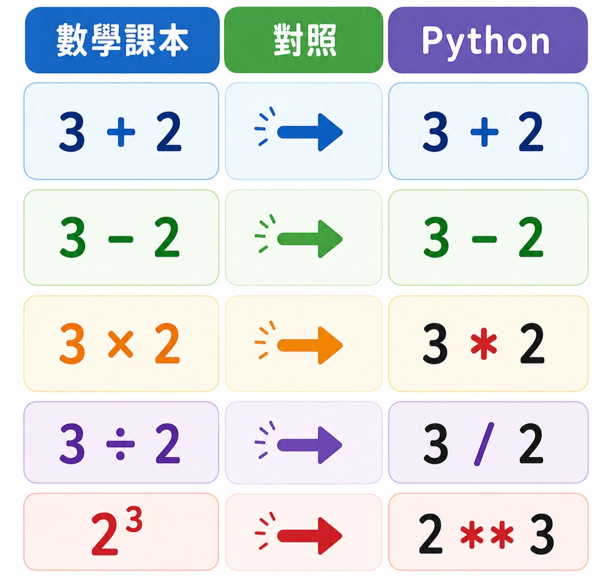
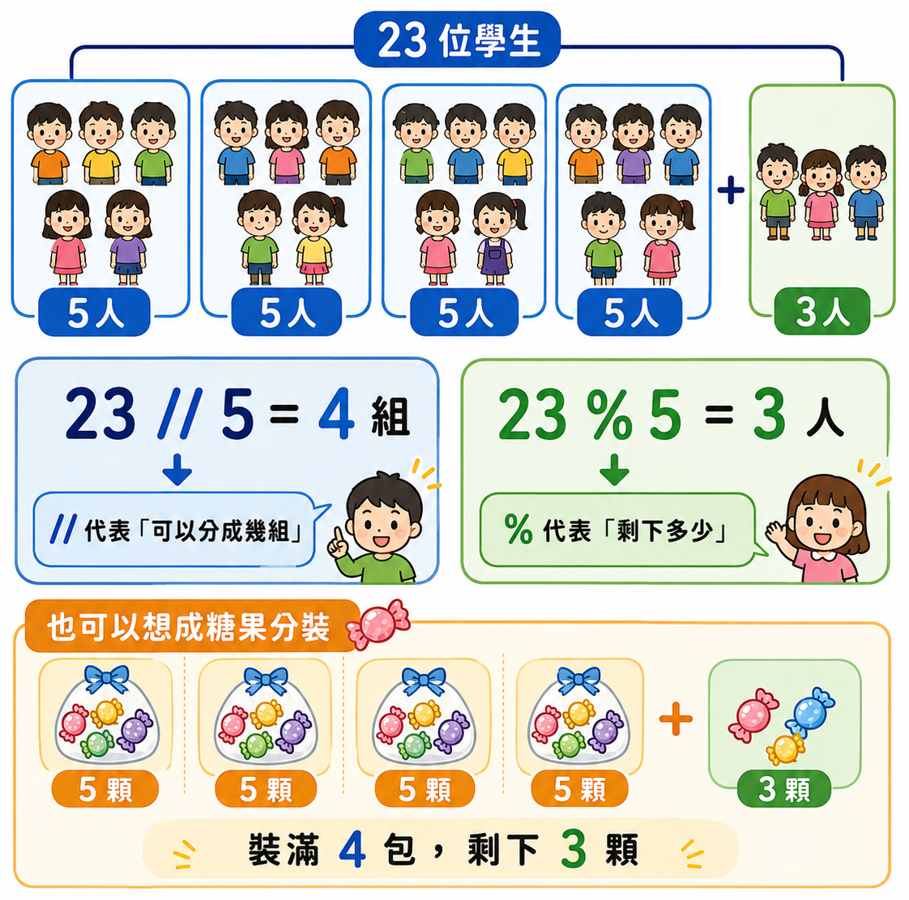
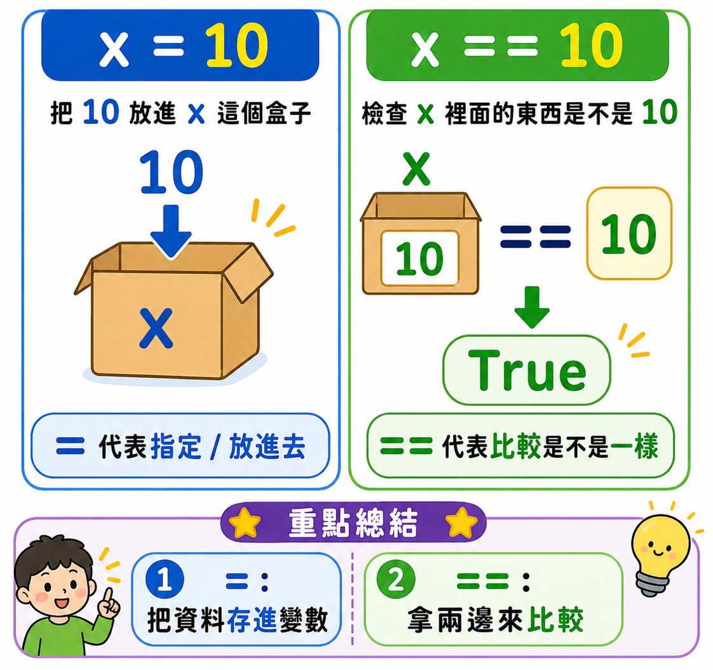

# Lesson 4 運算子 Operator

運算子可以想像成「程式裡的計算工具」。

就像計算機有加、減、乘、除按鈕一樣，Python 也有不同的運算子，

幫我們做數學計算、比較大小、判斷真假，也可以處理文字和串列。

> 資料 → 使用運算子處理 → 得到新的結果
> 

<p align="center">
  
</p>

---

## Section I. 什麼是運算子？

運算子 Operator 是用來表示「某一種運算方法」的符號或關鍵字。

在數學中，我們常見的運算子有：

```python
+
-
*
/
```

在程式中，運算子不只可以做數學計算，也可以做比較、邏輯判斷、字串連接、串列合併等事情。

| 類型 | 功能 | 結果常見型態 |
| --- | --- | --- |
| 數學運算子 | 做加減乘除、次方、取商、取餘數 | 數字 |
| 比較運算子 | 比較兩個值是否相同、誰大誰小 | `bool` |
| 邏輯運算子 | 判斷多個條件是否成立 | `bool` |
| 字串運算 | 連接文字或重複文字 | `str` |
| 串列運算 | 合併串列或重複串列 | `list` |

**生活例子：**

如果你用計算機算飲料錢：

```
60 元 × 3 杯 = 180 元
```

其中 `×` 就是一種運算子。

在 Python 裡，乘法要寫成：

```python
60 * 3
```

---

## Section II. 範例 9：輸入兩個數字並做四則運算

題目：輸入兩個數字 `a`、`b`，輸出兩數相加、相減、相乘、相除後的結果。

```python
a = int(input())
b = int(input())

print(a + b)
print(a - b)
print(a * b)
print(a / b)
```

如果輸入：

```
10
2
```

輸出：

```
12
8
20
5.0
```

注意：

`input()` 讀進來的資料一開始是文字，所以要用 `int()` 轉成整數，才能做數學計算。

---

## Section III. 數學運算子

數學運算子可以幫我們做常見的數學運算，例如加減乘除、次方、取商、取餘數。

| 運算子 | 功能 | 例子 | 結果 |
| --- | --- | --- | --- |
| `a + b` | 相加 | `3 + 2` | `5` |
| `a - b` | 相減 | `3 - 2` | `1` |
| `a * b` | 相乘 | `3 * 2` | `6` |
| `a / b` | 相除 | `3 / 2` | `1.5` |
| `a ** b` | a 的 b 次方 | `2 ** 3` | `8` |
| `a // b` | a 除以 b 後取商 | `7 // 3` | `2` |
| `a % b` | a 除以 b 後取餘數 | `7 % 3` | `1` |

<p align="center">
  
</p>

---

## Section IV. 指數與底數：`a ** b`

在數學中，常會看到平方、立方等寫法。

例如：

```
2 的 3 次方 = 2 × 2 × 2 = 8
```

在 Python 裡要寫成：

```python
print(2 ** 3)
```

輸出：

```
8
```

其中：

| 名稱 | 例子 |
| --- | --- |
| 底數 | `2` |
| 指數 | `3` |

也就是：

```
2 ** 3
```

代表 `2` 連續乘自己 `3` 次。

---

## Section V. 範例 10：計算 a 的 b 次方

題目：製作一個計算機，輸入 `a` 和 `b`，計算 `a` 的 `b` 次方。

```python
a = int(input())
b = int(input())

print(a ** b)
```

如果輸入：

```
2
5
```

輸出：

```
32
```

因為：

```
2 ** 5 = 2 × 2 × 2 × 2 × 2 = 32
```

---

## Section VI. 商數與餘數：分組問題

在除法中，常常會遇到「分組」問題。

例如：

```
有 23 位學生，每 5 位一組，可以分幾組？剩下幾人？
```

這時可以用：

```python
//
%
```

`//` 代表取商，也就是可以完整分成幾組。

`%` 代表取餘數，也就是剩下幾個。

```python
print(23 // 5)
print(23 % 5)
```

輸出：

```
4
3
```

意思是：

```
可以分成 4 組，剩下 3 人
```

<p align="center">
  
</p>

---

## Section VII. 範例 11：計算班級數與剩餘學生數

題目：

有一間學校共有 `n` 位新生，每 `k` 位一班，請製作一個程式，

輸入 `n`、`k` 後輸出班級數及未分到班級的學生數。

```python
n = int(input('n: '))
k = int(input('k: '))

print('班級數 =', n // k, '剩餘', n % k, '人')
```

如果輸入：

```
n: 23
k: 5
```

輸出：

```
班級數 = 4 剩餘 3 人
```

**生活例子：**

如果有 23 顆糖果，每包裝 5 顆：

```
23 // 5 = 4
23 % 5 = 3
```

代表可以裝滿 4 包，剩下 3 顆。

---

## Section VIII. 比較運算子

比較運算子用來比較兩個值的關係。

比較後的結果會是布林值：

```python
True
False
```

| 運算子 | 功能 | 例子 | 結果 |
| --- | --- | --- | --- |
| `a == b` | 相等 | `3 == 3` | `True` |
| `a != b` | 不相等 | `3 != 2` | `True` |
| `a > b` | a 大於 b | `5 > 2` | `True` |
| `a < b` | a 小於 b | `5 < 2` | `False` |
| `a >= b` | a 大於或等於 b | `5 >= 5` | `True` |
| `a <= b` | a 小於或等於 b | `3 <= 5` | `True` |

---

## Section IX. 一個等號和兩個等號不一樣

<p align="center">
  
</p>

在 Python 裡，一個等號和兩個等號的意思不一樣。

| 寫法 | 意思 |
| --- | --- |
| `=` | 指定、定義、把右邊的值放進左邊的變數 |
| `==` | 比較左右兩邊是否相等 |

例如：

```python
x = 10
```

意思是：

```
把 10 存進變數 x
```

而：

```python
print(x == 10)
```

意思是：

```
判斷 x 是否等於 10
```

輸出：

```
True
```

**常見錯誤提醒：**

```python
x = 10
```

不是在問 `x` 是否等於 `10`，而是在把 `10` 放進 `x`。

如果要比較，才要寫：

```python
x == 10
```

---

## Section X. 邏輯運算子：`and` 和 `or`

<p align="center">
  
</p>

邏輯運算子可以把多個條件合在一起判斷。

| 運算子 | 中文意思 | 判斷方式 |
| --- | --- | --- |
| `and` | 而且、並且 | 左右兩邊都要是 `True`，結果才是 `True` |
| `or` | 或者 | 左右只要有一邊是 `True`，結果就是 `True` |

### 1. `and` 的判斷

```python
print(True and True)
print(True and False)
print(False and True)
print(False and False)
```

輸出：

```
True
False
False
False
```

`and` 的重點是：

> 全部條件都成立，結果才成立。
> 

**生活例子：**

遊樂園設施規定：

```
身高超過 120 公分，而且年齡超過 10 歲，才可以搭乘。
```

這就是 `and`。

兩個條件都要符合才可以。

---

### 2. `or` 的判斷

```python
print(True or True)
print(True or False)
print(False or True)
print(False or False)
```

輸出：

```
True
True
True
False
```

`or` 的重點是：

> 只要有一個條件成立，結果就成立。
> 

**生活例子：**

優惠活動規定：

```
有會員卡，或者消費滿 300 元，就可以打折。
```

這就是 `or`。

只要符合其中一個條件就可以。

---

## Section XI. 邏輯運算順序

Python 計算邏輯運算時，常見順序是：

```
有括號先算 → 比較運算 → and → or
```

例如：

```python
print(True or False and True)
```

會先算：

```python
False and True
```

得到：

```python
False
```

所以原本的式子變成：

```python
True or False
```

最後結果是：

```
True
```

如果不確定順序，可以自己加括號讓意思更清楚：

```python
print(True or (False and True))
```

---

## Section XII. 範例 12：試著計算邏輯結果

請先不要執行，先自己猜猜看結果。

```python
print(True or False and True)
print(False and False or True)
print(True or False and True and False or True and False or True and True)
print(1 == '1' or 1 >= 1 and False or True)
```

提示：

```python
1 == '1'
```

結果是：

```
False
```

因為數字 `1` 和文字 `'1'` 的資料型態不同。

---

## Section XIII. 字串運算

字串也可以使用部分運算子。

字串常見的運算只有兩種：

| 運算 | 功能 |
| --- | --- |
| `字串 + 字串` | 把兩段文字接在一起 |
| `字串 * 整數` | 重複文字 |

### 1. 字串相加

```python
s1 = 'hello'
s2 = 'hi'

print(s1 + s2)
```

輸出：

```
hellohi
```

字串相加不是數學相加，而是把文字頭尾接起來。

### 2. 字串乘以整數

```python
s1 = 'hi'

print(s1 * 2)
```

輸出：

```
hihi
```

意思是把 `'hi'` 重複 2 次。

**常見錯誤提醒：**

```python
print('hi' * 2)
```

可以執行。

但是：

```python
print('hi' * '2')
```

會出錯，因為字串只能乘以整數。

---

## Section XIV. 範例 13：輸入使用者名稱並輸出問候語

題目：獲取使用者名稱，輸出：

```
hi 使用者名稱
```

```python
print('hi ' + input('pls enter ur name: '))
```

如果輸入：

```
Tom
```

輸出：

```
hi Tom
```

也可以寫成比較清楚的版本：

```python
name = input('pls enter ur name: ')
print('hi ' + name)
```

---

## Section XV. 串列運算

串列 `list` 和字串一樣，可以進行相加和乘以整數。

| 運算 | 功能 |
| --- | --- |
| `串列 + 串列` | 把兩個串列接在一起 |
| `串列 * 整數` | 重複串列內容 |

### 1. 串列相加

```python
l1 = [123]
l2 = [456]

print(l1 + l2)
```

輸出：

```
[123, 456]
```

### 2. 串列乘以整數

```python
l1 = [123]

print(l1 * 2)
```

輸出：

```
[123, 123]
```

**生活例子：**

如果一個清單是：

```python
['奶茶']
```

乘以 `3`：

```python
['奶茶'] * 3
```

結果會變成：

```python
['奶茶', '奶茶', '奶茶']
```

---

## Section XVI. 完整小範例

### 範例 1：計算總價

```python
price = int(input('請輸入單價：'))
count = int(input('請輸入數量：'))

print('總價 =', price * count)
```

### 範例 2：判斷是否及格

```python
score = int(input('請輸入分數：'))

print(score >= 60)
```

### 範例 3：判斷是否可以搭乘設施

```python
height = int(input('請輸入身高：'))
age = int(input('請輸入年齡：'))

print(height >= 120 and age >= 10)
```

### 範例 4：重複輸出字串

```python
word = input('請輸入一個字：')
count = int(input('請輸入重複次數：'))

print(word * count)
```

---

## Section XVII. 重點複習

| 重點 | 說明 |
| --- | --- |
| 運算子 | 代表特定運算方法的符號或關鍵字。 |
| 數學運算子 | 計算結果通常是數字。 |
| 比較運算子 | 計算結果是 `True` 或 `False`。 |
| `=` | 指定變數。 |
| `==` | 比較是否相等。 |
| `and` | 左右兩邊都要是 `True`，結果才是 `True`。 |
| `or` | 左右只要有一邊是 `True`，結果就是 `True`。 |
| 字串 `+` | 把兩個字串接起來。 |
| 字串 `* 整數` | 重複字串。 |
| 串列 `+` | 把兩個串列接起來。 |
| 串列 `* 整數` | 重複串列內容。 |

---

## Section XVIII. 課堂練習

- Q1. 輸入兩個整數 `a`、`b`，輸出相加、相減、相乘、相除的結果。
- Q2. 輸入兩個整數 `a`、`b`，輸出 `a` 的 `b` 次方。
- Q3. 輸入學生總人數 `n` 和每班人數 `k`，輸出可以分成幾班，以及剩下幾人。
- Q4. 輸入一個分數，輸出這個分數是否及格。
- Q5. 輸入身高和年齡，判斷是否同時符合「身高至少 120」和「年齡至少 10」。
- Q6. 輸入一個名字，輸出 `hi 名字`。
- Q7. 輸入一個字串和一個整數，輸出重複後的字串。

---

## Section XIX. 課後練習

### Q4. 基本運算練習

題目：輸入兩個整數 `a`、`b`，輸出相加、相減、相乘、相除、`a` 的 `b` 次方。

```python
a = int(input())
b = int(input())

print(a + b)
print(a - b)
print(a * b)
print(a / b)
print(a ** b)
```

---

---

---