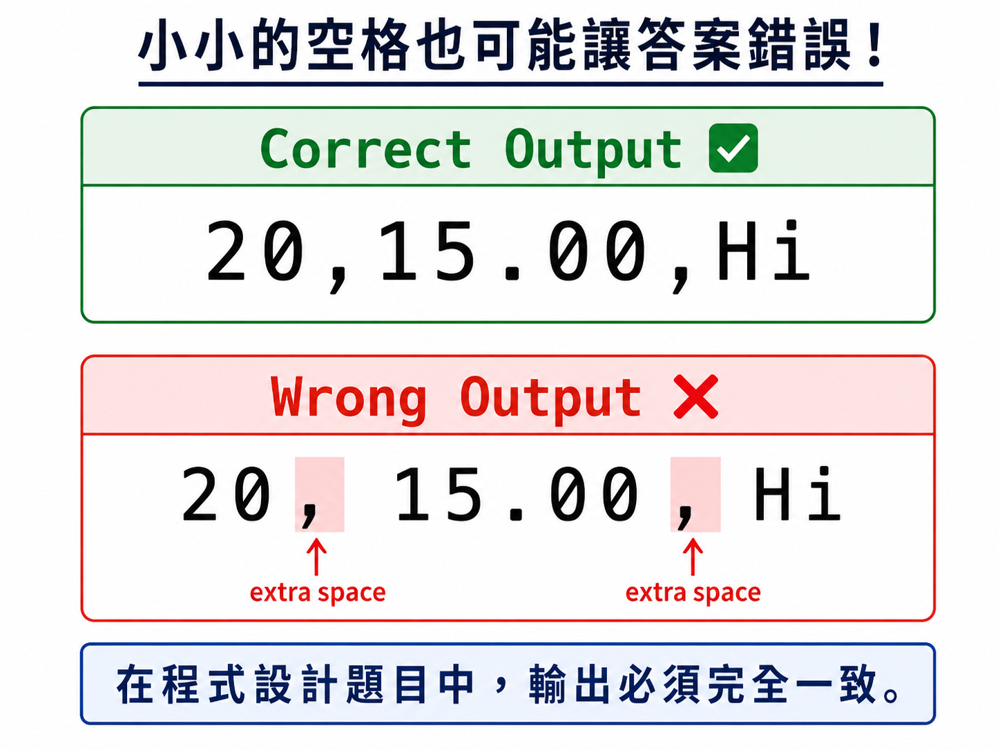
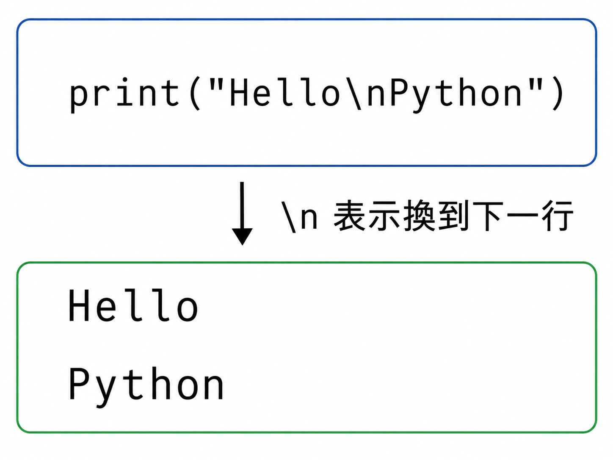
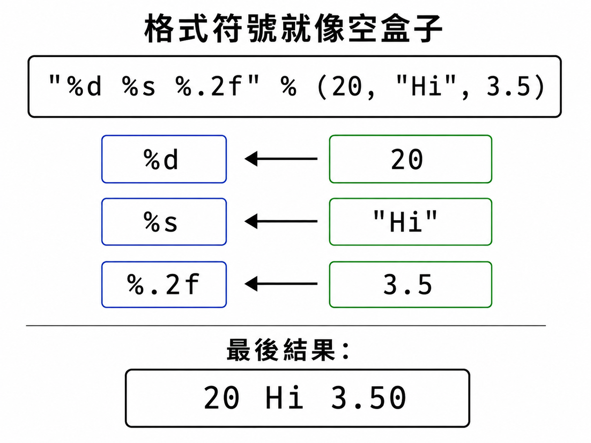
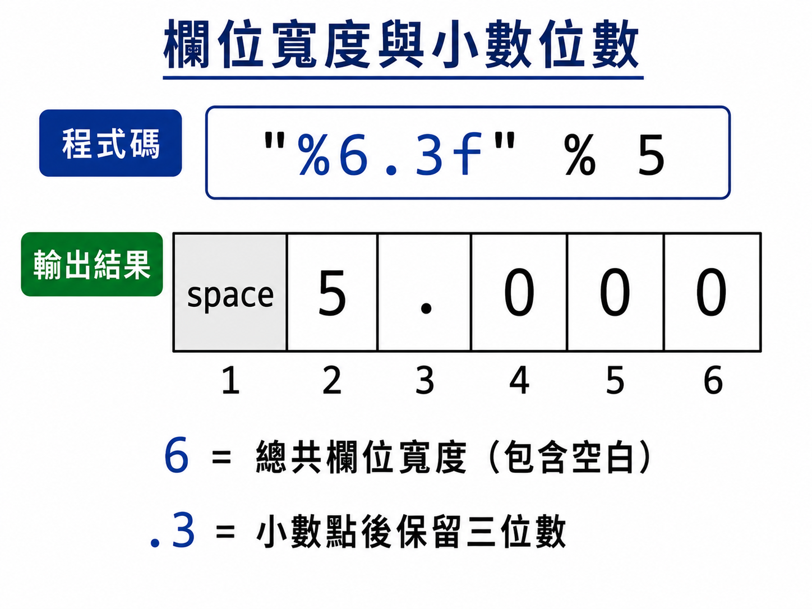

# Lesson 5: 格式化輸出 Format

在 APCS 或一般程式練習中，題目常常會要求你按照指定格式輸出答案，例如小數點後幾位、欄位寬度、換行、空白等。

這堂課會幫你看懂常見的格式化方式，並練習把資料印成題目要的樣子。

> 這堂課的重點：把資料整理成指定格式，再正確輸出。
> 

---

## Section I. 今天要做什麼？

1. 認識什麼是格式化輸出。
2. 學會常見特殊字元，例如 `\n`。
3. 認識 `%` 格式化方法。
4. 認識 `.format()` 格式化方法。
5. 練習輸出整數、字串與浮點數。
6. 練習控制小數位數與欄位寬度。

---

## Section II. 今天的學習方式

不用一開始就把所有格式符號背起來，先做到：

1. 看得懂格式符號的意思。
2. 知道什麼時候要用整數、字串或浮點數格式。
3. 題目要求小數位數時，能正確輸出。
4. 遇到輸出格式錯誤時，知道要檢查空格、逗號、換行和小數位數。

---

## Section III. 今天會學到的內容

| 主題 | 你需要知道的事 |
| --- | --- |
| 特殊字元 | 用 `\` 搭配特定符號表示換行、反斜線等特殊效果 |
| `%` 格式化 | 用 `%d`、`%s`、`%f` 控制輸出資料型態 |
| `.format()` | 用 `{}` 搭配 `.format()` 把資料放到指定位置 |
| 欄位寬度 | 控制輸出至少佔幾個字元 |
| 小數位數 | 控制浮點數要顯示到小數點後幾位 |

---

## Section IV. 寫題目前的提醒

### 1. 格式錯一點點也可能答案錯

在程式題目中，輸出結果常常需要完全一樣。

<p align="center">
  
</p>

例如：

```
20,15.00,Hi
```

和：

```
20, 15.00, Hi
```

看起來很像，但空格不同，可能會被判成不同答案。

### 2. 注意整數、字串、浮點數不同

```python
20      # int 整數
"20"    # str 字串
20.0    # float 浮點數
```

格式化時，要選對對應的格式符號。

### 3. 先看清楚題目要求

寫程式前可以先問自己：

- 要印幾個資料？
- 中間要不要逗號或空格？
- 小數要印幾位？
- 要不要換行？
- 每個資料至少要佔幾個字元？

---

## Section V. 核心概念說明

### 1. 什麼是格式化輸出？

格式化輸出就是把資料用指定的樣子印出來。

例如，同樣是數字 `5`，可以印成：

```
5
5.0
5.00
  5
005
```

這些值看起來都和 `5` 有關，但輸出的格式不同。

### 2. 特殊字元

在 Python 字串中，可以用反斜線 `\` 加上某些字元，表示特殊效果。

| 寫法 | 意思 |
| --- | --- |
| `\\` | 印出一個反斜線 `\` |
| `\n` | 換行 |
| `\t` | tab 空格 |
| `\f` | 換頁字元，初學比較少用 |
| `\ooo` | 八進位字元，例如 `\101` |
| `\xhh` | 十六進位字元，例如 `\x41` |

<p align="center">
  
</p>

範例：

```python
print("Hello\nPython")
```

結果：

```
Hello
Python
```

說明：

`\n` 會讓輸出換到下一行。

### 3. `%` 格式化

`%` 格式化是一種比較舊但仍常見的格式化方式。

<p align="center">
  
</p>

常見格式符號：

| 格式符號 | 意思 | 範例資料 |
| --- | --- | --- |
| `%d` | 以整數輸出 | `20` |
| `%s` | 以字串輸出 | `"Hi"` |
| `%f` | 以浮點數輸出 | `3.14` |

範例：

```python
print("%d%s" % (20, "Hi"))
```

結果：

```
20 Hi
```

說明：

第一個 `%d` 對應到 `20`，第二個 `%s` 對應到 `"Hi"`。中間的空格是格式字串自己寫進去的。

### 4. `%f` 與小數位數

<p align="center">
  
</p>

```python
print("%f" % 5)
```

結果：

```
5.000000
```

如果想控制小數點後兩位，可以寫：

```python
print("%.2f" % 5)
```

結果：

```
5.00
```

### 5. 欄位寬度與小數位數

```python
print("%6.3f" % 5)
```

結果：

```
 5.000
```

說明：

`%6.3f` 的意思是：

- `6`：至少輸出 6 個字元，包含小數點。
- `.3`：小數點後印出 3 位。
- `f`：用浮點數格式輸出。

`5.000` 本身剛好是 5 個字元，所以前面會補 1 個空白。

### 6. `.format()` 格式化

`.format()` 可以把資料放進 `{}` 裡。

範例：

```python
print("{}{}".format(20, "Hi"))
```

結果：

```
20 Hi
```

也可以指定位置：

```python
print("{0}{1}{0}".format("A", "B"))
```

結果：

```
A B A
```

說明：

- `{0}` 代表取第 0 個資料。
- `{1}` 代表取第 1 個資料。
- 中間的空格是格式字串自己寫進去的。

### 7. `.format()` 的欄位寬度

```python
print("{0:3}{1:3}".format(12, 345))
```

結果：

```
 12 345
```

說明：

`{0:3}` 代表取第 0 個資料，至少印出 3 個字元。`12` 只有 2 個字元，所以前面會補 1 個空白。

---

## Section VI. 快速概念檢查

請先不要急著執行，先用眼睛看，猜猜看答案。

### Q1. 換行符號

```python
print("A\nB")
```

Question:
你覺得結果會是什麼？

Answer:

```
A
B
```

Explanation:
`\n` 會讓輸出換到下一行。

### Q2. 整數格式

```python
print("%d" % 20)
```

Question:
你覺得結果會是什麼？

Answer:

```
20
```

Explanation:
`%d` 會用整數格式輸出。

### Q3. 字串格式

```python
print("%s" % 20)
```

Question:
你覺得結果會是什麼？

Answer:

```
20
```

Explanation:
`%s` 會把資料用字串形式輸出，所以數字 `20` 也可以被放進 `%s`。

### Q4. 小數兩位

```python
print("%.2f" % 3)
```

Question:
你覺得結果會是什麼？

Answer:

```
3.00
```

Explanation:
`%.2f` 代表小數點後顯示兩位。

### Q5. format 位置

```python
print("{1}{0}".format("A", "B"))
```

Question:
你覺得結果會是什麼？

Answer:

```
B A
```

Explanation:
`{1}` 取第 1 個資料，也就是 `"B"`；`{0}` 取第 0 個資料，也就是 `"A"`。

---

## Section VII. 程式閱讀練習

### 題目 1：觀察小數輸出

```python
x = 7
print("%.3f" % x)
```

思考方式：

```
x 是 7。
%.3f 代表用浮點數格式輸出，而且小數點後要有 3 位。
```

所以答案是：

```
7.000
```

### 題目 2：觀察欄位寬度

```python
print("%5d" % 12)
```

思考方式：

```
12 本身有 2 個字元。
%5d 代表至少佔 5 個字元。
所以前面會補 3 個空白。
```

所以答案是：

```
   12
```

### 題目 3：觀察 format 的位置

```python
print("{2}-{0}-{1}".format("A", "B", "C"))
```

思考方式：

```
第 0 個資料是 A。
第 1 個資料是 B。
第 2 個資料是 C。
輸出順序是第 2 個、第 0 個、第 1 個。
```

所以答案是：

```
C-A-B
```

---

## Section VIII. 實作練習 / 實作檢測題

請完成下面的函式。這些題目主要練習「回傳格式化後的字串」。

提醒：這一區請使用 `return`，不要使用 `print()`。

### Q1. 整數轉成字串

完成函式：

```python
def q1_int_to_string(x):
    #TODO: 回傳 x 的字串格式
    return None
```

範例：

```python
q1_int_to_string(20)
```

應該回傳：

```
20
```

### Q2. 浮點數保留兩位小數

完成函式：

```python
def q2_two_decimal(x):
    #TODO: 回傳 x 的小數點後兩位格式
    return None
```

範例：

```python
q2_two_decimal(5)
```

應該回傳：

```
5.00
```

### Q3. 浮點數保留三位小數

完成函式：

```python
def q3_three_decimal(x):
    #TODO: 回傳 x 的小數點後三位格式
    return None
```

範例：

```python
q3_three_decimal(2)
```

應該回傳：

```
2.000
```

### Q4. 姓名格式

完成函式：

```python
def q4_name_format(name):
    #TODO: 回傳 Hello, name!
    return None
```

範例：

```python
q4_name_format("Amy")
```

應該回傳：

```
Hello, Amy!
```

### Q5. 兩個數字用逗號連接

完成函式：

```python
def q5_two_numbers(a, b):
    #TODO: 回傳 a,b 的格式，中間用逗號連接
    return None
```

範例：

```python
q5_two_numbers(3, 8)
```

應該回傳：

```
3,8
```

### Q6. 整數至少佔 4 格

完成函式：

```python
def q6_width_four(x):
    #TODO: 回傳 x 至少佔 4 個字元的格式
    return None
```

範例：

```python
q6_width_four(12)
```

應該回傳：

```
  12
```

### Q7. 分數格式

完成函式：

```python
def q7_score_format(name, score):
    #TODO: 回傳「name: score」格式
    return None
```

範例：

```python
q7_score_format("Amy", 90)
```

應該回傳：

```
Amy: 90
```

### Q8. BMI 格式

完成函式：

```python
def q8_bmi_format(bmi):
    #TODO: 回傳 BMI 到小數點後一位
    return None
```

範例：

```python
q8_bmi_format(22)
```

應該回傳：

```
22.0
```

### Q9. 三個資料格式化

完成函式：

```python
def q9_three_data(a, b, c):
    #TODO: 回傳 a,b,c，中間用逗號和一個空格隔開
    return None
```

範例：

```python
q9_three_data(20, 15.5, "Hi")
```

應該回傳：

```
20, 15.5, Hi
```

### Q10. 指定輸出格式

完成函式：

```python
def q10_target_format(data):
    # data 是一個 list，例如 [20, 15, "Hi"]
    #TODO: 回傳指定格式
    return None
```

範例：

```python
q10_target_format([20, 15, "Hi"])
```

應該回傳：

```
 20, 15.00,   Hi
```

---

## Section IX. 做題時可以使用的提示

### 1. 用 `%s` 做字串格式

```python
"%s" % name
```

### 2. 用 `%.2f` 控制小數點後兩位

```python
"%.2f" % x
```

### 3. 用 `%4d` 控制整數至少佔 4 格

```python
"%4d" % x
```

### 4. 用 `.format()` 放入資料

```python
"{}: {}".format(name, score)
```

### 5. 用索引取出 list 裡的資料

```python
data = [20, 15, "Hi"]

print(data[0])
print(data[1])
print(data[2])
```

---

## Section X. 課後小練習

### 練習 1：價格格式

寫一個函式：

```python
def practice_price(price):
    return None
```

回傳價格格式，小數點後固定兩位。

範例：

```python
practice_price(30)
```

應該回傳：

```
30.00
```

### 練習 2：座號格式

寫一個函式：

```python
def practice_seat_number(n):
    return None
```

回傳至少佔 3 格的整數格式。

範例：

```python
practice_seat_number(7)
```

應該回傳：

```
  7
```

### 練習 3：簡單成績單

寫一個函式：

```python
def practice_report(name, score):
    return None
```

回傳 `姓名 - 分數` 的格式。

範例：

```python
practice_report("Ben", 85)
```

應該回傳：

```
Ben - 85
```

### 練習 4：平均分數

寫一個函式：

```python
def practice_average(a, b):
    return None
```

回傳 `a` 和 `b` 的平均值，小數點後固定一位。

範例：

```python
practice_average(80, 90)
```

應該回傳：

```
85.0
```

---

## Section XI. 重點複習

| 重點 | 說明 |
| --- | --- |
| `\n` | 換行 |
| `%d` | 整數格式 |
| `%s` | 字串格式 |
| `%f` | 浮點數格式 |
| `%.2f` | 小數點後兩位 |
| `%6.3f` | 至少 6 格，小數點後 3 位 |
| `.format()` | 把資料放入 `{}` 中 |
| `{0}` | 取第 0 個資料 |
| `{0:3}` | 第 0 個資料至少佔 3 格 |

---

## Section XII. 常見錯誤提醒

### 1. 忘記格式和資料數量要對應

```python
print("%d%s" % (20))
```

這樣會出錯，因為格式中有兩個位置，但資料只有一個。

正確寫法：

```python
print("%d%s" % (20, "Hi"))
```

### 2. 忘記字串要加引號

```python
print("%s" % Hi)
```

這樣會出錯，因為 `Hi` 沒有被當成變數，但前面沒有設定這個變數。

正確寫法：

```python
print("%s" % "Hi")
```

### 3. 小數位數不符合題目要求

如果題目要求：

```
5.00
```

但你輸出：

```
5.0
```

格式就不一樣。

這時要記得使用：

```python
"%.2f" % 5
```