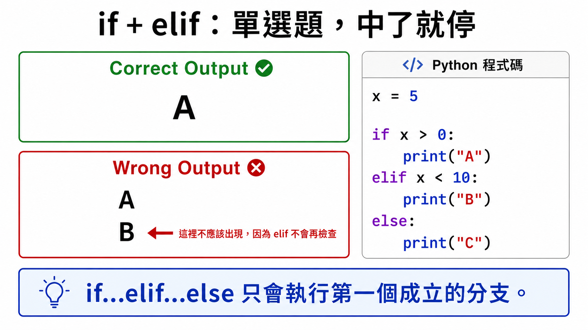
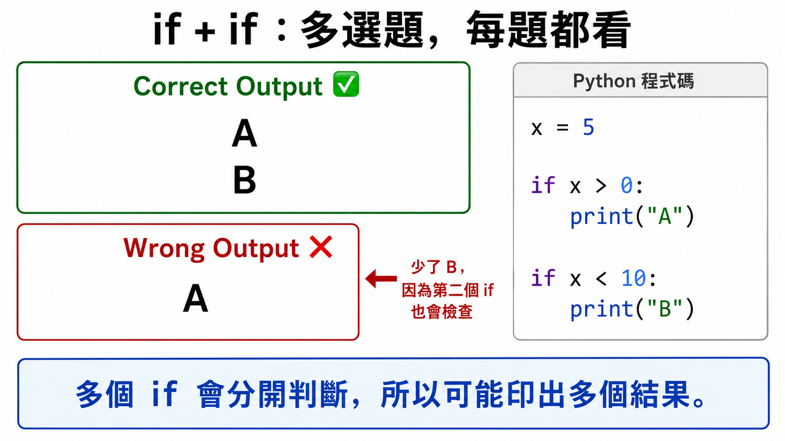
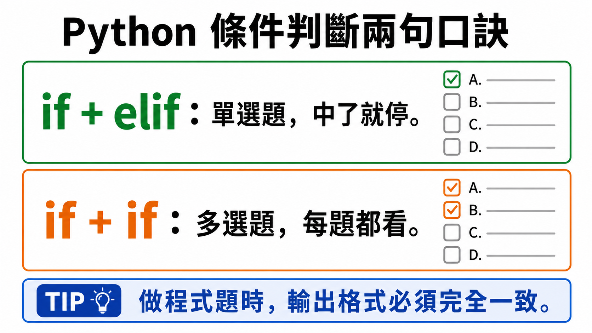
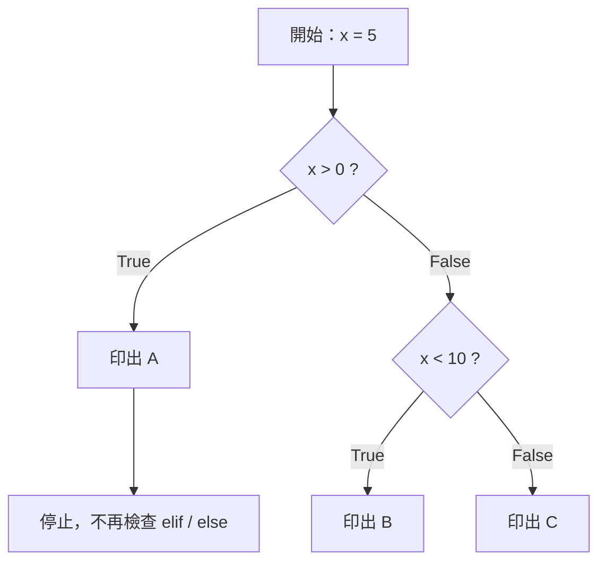
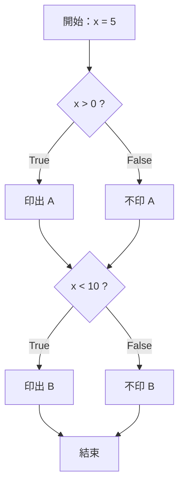

# Lesson 6：Conditional Expressions 條件判斷

> 這堂課的重點：學會用 `if`、`elif`、`else` 判斷不同情況，
並理解「多個 `if`」和「`if...elif...else`」的差別。
> 

---

## Section I. 今天要做什麼？

1. 認識什麼是條件。
2. 學會基本的 `if` 寫法。
3. 學會使用 `else` 處理條件不成立的情況。
4. 學會使用 `elif` 判斷多個條件。
5. 理解「多個 `if`」和「`if...elif...else`」的差別。
6. 練習閱讀條件判斷程式。
7. 完成幾題條件判斷實作練習。

---

## Section II. 今天的學習方式

1. 看得懂 `if`、`elif`、`else` 的基本結構。
2. 知道條件通常會得到 `True` 或 `False`。
3. 可以依照題目要求寫出簡單判斷。
4. 出錯時知道要檢查縮排、冒號、條件式。
5. 看到程式碼時，可以一步一步判斷會印出什麼。

---

## Section III. 今天會學到的內容

| 主題 | 你需要知道的事 |
| --- | --- |
| 條件 | 用來判斷某件事是否成立 |
| `True` / `False` | 條件判斷的結果 |
| `if` | 條件成立時執行某段程式 |
| `else` | 條件不成立時執行另一段程式 |
| `elif` | 用來判斷第二個、第三個條件 |
| 多個 `if` | 每個 `if` 都會各自判斷一次 |
| `if...elif...else` | 前面條件成立後，後面就不再判斷 |
| `print()` | 把結果顯示在畫面上 |

---

## Section IV. 寫題目前的提醒

### 1. 條件通常會得到 `True` 或 `False`

條件判斷中，常見的條件會使用比較運算子或邏輯運算子。

例如：

```python
x == 1
x > 10
x % 2 == 0
```

這些條件的結果會是 `True` 或 `False`。

| 條件 | 中文意思 | 結果 |
| --- | --- | --- |
| `5 > 3` | 5 大於 3 嗎？ | `True` |
| `2 > 10` | 2 大於 10 嗎？ | `False` |
| `4 == 4` | 4 等於 4 嗎？ | `True` |
| `4 == 5` | 4 等於 5 嗎？ | `False` |

---

### 2. 注意 `=` 和 `==` 的差別

```python
x = 5      # 把 5 放進 x
x == 5     # 問：x 是不是等於 5？
```

記法：

```
= 是放進去
== 是問是不是一樣
```

---

### 3. 注意冒號 `:`

`if`、`elif`、`else` 後面都需要冒號。

```python
if x > 0:
    print("positive")
```

如果忘記冒號，程式會出錯。

---

### 4. 注意縮排

Python 用縮排表示「這一行屬於哪個區塊」。

```python
if x > 0:
    print("positive")
```

這裡的 `print("positive")` 因為有縮排，所以代表條件成立時才會執行。

也可以觀察這個例子：

```python
if x > 0:
    print("A")
print("B")
```

`print("A")` 有縮排，所以屬於 `if`。

`print("B")` 沒有縮排，所以不屬於 `if`，不管條件成不成立都會執行。

---

### 5. 先想清楚每個條件代表什麼

寫條件前，可以先問自己：

- 題目給我什麼資料？
- 我要判斷什麼情況？
- 條件成立時要做什麼？
- 條件不成立時要做什麼？
- 會不會有第三種、第四種情況？

---

## Section V. 核心概念說明

### 1. 什麼是條件？

條件是用來判斷一個狀況是否成立。

例如：

```python
x = 5
print(x > 3)
```

Result:

```
True
```

因為 `5 > 3` 是成立的，所以結果是 `True`。

---

### 2. 基本 `if` 寫法

如果條件成立，就執行 `if` 裡面的程式。

```python
user_input = 1

if user_input == 1:
    print(1)
```

Result:

```
1
```

因為 `user_input == 1` 是 `True`，所以會印出 `1`。

---

### 3. 使用 `else`

`else` 代表「如果前面的條件不成立，就執行這裡」。

```python
user_input = 3

if user_input == 1:
    print(1)
else:
    print("不是1")
```

Result:

```
不是1
```

因為 `user_input == 1` 是 `False`，所以會執行 `else`。

---

### 4. 使用 `elif`

當我們有多個情況要判斷時，可以使用 `elif`。

```python
user_input = 2

if user_input == 1:
    print(1)
elif user_input == 2:
    print(2)
else:
    print("都不是")
```

Result:

```
2
```

因為第一個條件 `user_input == 1` 不成立，但第二個條件 `user_input == 2` 成立，所以會印出 `2`。

---

### 5. `if...elif...else` 的執行順序

Python 會從上到下檢查條件。

只要其中一個條件成立並執行，後面的 `elif` 和 `else` 就不會再執行。

```python
x = 1

if x == 1:
    print("A")
elif x > 0:
    print("B")
else:
    print("C")
```

Result:

```
A
```

雖然 `x > 0` 也是成立的，但是第一個條件已經成立，所以後面的 `elif` 不會再執行。

---

### 6. 多個 `if` 和 `if...elif` 不一樣

如果使用多個 `if`，每個 `if` 都會各自判斷一次。

```python
x = 1

if x == 1:
    print("A")

if x > 0:
    print("B")
```

Result:

```
A
B
```

因為兩個 `if` 都會各自判斷，而且兩個條件都成立，所以會印出兩行。

---

## Section V-A. 容易搞混的重點：`elif` 只會選一個

這一節要特別記住兩個口訣：

```
if + elif：單選題，中了就停。
if + if：多選題，每題都看。
```

---

### 1. `if...elif...else` 是單選題

`if...elif...else` 很像考試裡的「單選題」。

只要前面有一個條件成立，後面的 `elif` 和 `else` 就不會再檢查。

口訣：

```
if + elif：單選題，中了就停。
```

<p align="center">
  
</p>

if + elif 單選題示意圖

Example:

```python
x = 5

if x > 0:
    print("A")
elif x < 10:
    print("B")
else:
    print("C")
```

思考方式：

```
x 是 5

第一個條件：x > 0
5 > 0 成立，所以印出 A。

因為這是 if...elif...else，
第一個條件已經成立，
所以後面的 elif 和 else 不會再看。
```

Result:

```
A
```

雖然 `x < 10` 也是成立的，但是因為前面已經成功了，所以不會印出 `B`。

---

### 2. 多個 `if` 是多選題

如果是多個分開的 `if`，每一個 `if` 都會自己判斷一次。

口訣：

```
if + if：多選題，每題都看。
```

<p align="center">
  
</p>

if + if 多選題示意圖

Example:

```python
x = 5

if x > 0:
    print("A")

if x < 10:
    print("B")
```

思考方式：

```
x 是 5

第一個 if：x > 0
5 > 0 成立，所以印出 A。

第二個 if：x < 10
5 < 10 也成立，所以印出 B。
```

Result:

```
A
B
```

---

### 3. 單選題 vs 多選題對照

| 寫法 | 像什麼題型 | 會檢查幾次？ | 結果 |
| --- | --- | --- | --- |
| `if...elif...else` | 單選題 | 找到第一個成立就停止 | 只執行一個分支 |
| 多個 `if` | 多選題 | 每個 `if` 都會檢查 | 可能執行多個分支 |

記法：

```
elif 代表「不然如果」。
前面已經成功，就沒有「不然」了。
```

---

### 4. 一起想一次

```python
score = 75

if score >= 90:
    print("A")
elif score >= 60:
    print("pass")
else:
    print("fail")
```

思考方式：

```
score 是 75

第一個條件：75 >= 90
不成立，所以往下看。

第二個條件：75 >= 60
成立，所以印出 pass。

因為 elif 是單選題，
找到第一個成立的條件後，
後面就不看了。
```

Result:

```
pass
```

---

## Section VI. 快速概念檢查

請先不要急著執行，先用眼睛看，猜猜看答案。

### Q1. 條件是否成立？

```python
x = 10
print(x > 5)
```

Question:

你覺得結果會是什麼？

Answer:

```
True
```

Explanation:

因為 `10 > 5` 是成立的，所以結果是 `True`。

---

### Q2. 基本 `if`

```python
x = 3

if x == 3:
    print("yes")
```

Question:

你覺得結果會是什麼？

Answer:

```
yes
```

Explanation:

因為 `x == 3` 成立，所以會執行 `print("yes")`。

---

### Q3. 使用 `else`

```python
x = 4

if x == 3:
    print("yes")
else:
    print("no")
```

Question:

你覺得結果會是什麼？

Answer:

```
no
```

Explanation:

因為 `x == 3` 不成立，所以會執行 `else`。

---

### Q4. 使用 `elif`

```python
x = 2

if x == 1:
    print("one")
elif x == 2:
    print("two")
else:
    print("other")
```

Question:

你覺得結果會是什麼？

Answer:

```
two
```

Explanation:

第一個條件不成立，第二個條件成立，所以印出 `two`。

---

### Q5. 多個 `if`

```python
x = 5

if x > 0:
    print("positive")

if x < 10:
    print("small")
```

Question:

你覺得結果會是什麼？

Answer:

```
positive
small
```

Explanation:

這裡有兩個獨立的 `if`，所以兩個條件都會被檢查。因為兩個條件都成立，所以會印出兩行。

---

### Q6. `elif` 只會選一個

```python
x = 5

if x > 0:
    print("A")
elif x < 10:
    print("B")
```

Question:

你覺得結果會是什麼？

Answer:

```
A
```

Explanation:

雖然 `x < 10` 也是成立的，但是 `if...elif` 是單選題，第一個條件成立後就停止。

---

### Q7. 多個 `if` 會都檢查

```python
x = 5

if x > 0:
    print("A")

if x < 10:
    print("B")
```

Question:

你覺得結果會是什麼？

Answer:

```
A
B
```

Explanation:

這裡是兩個獨立的 `if`，所以兩個條件都會被檢查。

---

## Section VII. 程式閱讀練習

### 題目 1：判斷輸入是否為 1

```python
x = 1

if x == 1:
    print(1)
else:
    print("不是1")
```

思考方式：

```
x 是 1
檢查 x == 1
條件成立
執行 if 裡面的 print(1)
else 不會執行
```

所以答案是：

```
1
```

---

### 題目 2：判斷多個數字

```python
x = 3

if x == 1:
    print(1)
elif x == 2:
    print(2)
else:
    print("都不是")
```

思考方式：

```
x 是 3
x == 1 不成立
x == 2 不成立
執行 else
```

所以答案是：

```
都不是
```

---

### 題目 3：`elif` 只會選一個分支

```python
x = 1

if x == 1:
    print(1)
elif x % 1 == 0:
    print(x)
```

思考方式：

```
x 是 1
第一個條件 x == 1 成立
印出 1
因為使用 elif，後面的條件不會再檢查
```

所以答案是：

```
1
```

---

### 題目 4：多個 `if` 會分開判斷

```python
x = 1

if x == 1:
    print(1)

if x % 1 == 0:
    print(x)
```

思考方式：

```
x 是 1
第一個 if：x == 1 成立，所以印出 1
第二個 if：x % 1 == 0 也成立，所以再印出 x
```

所以答案是：

```
1
1
```

---

### 題目 5：分數等級判斷

```python
score = 75

if score >= 90:
    print("A")
elif score >= 60:
    print("pass")
else:
    print("fail")
```

思考方式：

```
score 是 75
75 >= 90 不成立
75 >= 60 成立
所以印出 pass
後面的 else 不會執行
```

所以答案是：

```
pass
```

---

## Section VIII. 實作練習 / 實作檢測題

以下題目請使用 `print()` 顯示結果。

---

### Q1. 判斷是否為 1

完成程式：

```python
x = 1

#TODO:
# 如果 x 是 1，印出 "yes"
# 否則印出 "no"
```

Example Output:

```
yes
```

---

### Q2. 判斷是否為正數

完成程式：

```python
x = 5

#TODO:
# 如果 x 大於 0，印出 "positive"
# 否則印出 "not positive"
```

Example Output:

```
positive
```

---

### Q3. 判斷奇偶數

完成程式：

```python
x = 7

#TODO:
# 如果 x 是偶數，印出 "even"
# 否則印出 "odd"
```

提醒：

```python
x % 2 == 0
```

意思是：`x` 除以 2 的餘數是不是 0？

Example Output:

```
odd
```

---

### Q4. 判斷成績是否及格

完成程式：

```python
score = 80

#TODO:
# 如果 score 大於等於 60，印出 "pass"
# 否則印出 "fail"
```

Example Output:

```
pass
```

---

### Q5. 判斷數字大小分類

完成程式：

```python
x = 0

#TODO:
# 如果 x 大於 0，印出 "positive"
# 如果 x 小於 0，印出 "negative"
# 否則印出 "zero"
```

Example Output:

```
zero
```

---

### Q6. 判斷是否為 1 或 2

完成程式：

```python
x = 2

#TODO:
# 如果 x 是 1，印出 "one"
# 如果 x 是 2，印出 "two"
# 否則印出 "other"
```

Example Output:

```
two
```

---

### Q7. 判斷是否可以買票

完成程式：

```python
age = 16

#TODO:
# 如果 age 大於等於 18，印出 "adult ticket"
# 否則印出 "student ticket"
```

Example Output:

```
student ticket
```

---

### Q8. 判斷兩個數是否相等

完成程式：

```python
a = 3
b = 3

#TODO:
# 如果 a 和 b 相等，印出 "same"
# 否則印出 "different"
```

Example Output:

```
same
```

---

### Q9. 判斷是否在範圍內

完成程式：

```python
x = 8

#TODO:
# 如果 x 大於等於 1 且小於等於 10，印出 "in range"
# 否則印出 "out of range"
```

Example Output:

```
in range
```

---

### Q10. 判斷登入狀態

完成程式：

```python
username = "admin"
password = "1234"

#TODO:
# 如果 username 是 "admin" 且 password 是 "1234"，印出 "success"
# 否則印出 "fail"
```

Example Output:

```
success
```

---

## Section IX. 做題時可以使用的提示

### 1. 基本 `if` 寫法

```python
if 條件:
    print(結果)
```

---

### 2. `if...else` 寫法

```python
if 條件:
    print(結果1)
else:
    print(結果2)
```

---

### 3. `if...elif...else` 寫法

```python
if 條件1:
    print(結果1)
elif 條件2:
    print(結果2)
else:
    print(結果3)
```

---

### 4. 判斷偶數

```python
x % 2 == 0
```

如果一個數除以 2 的餘數是 0，代表它是偶數。

---

### 5. 同時滿足兩個條件

```python
x >= 1 and x <= 10
```

`and` 代表兩邊都要成立。

| `x` | `x >= 1` | `x <= 10` | 結果 |
| --- | --- | --- | --- |
| 5 | True | True | in range |
| 0 | False | True | out of range |
| 12 | True | False | out of range |

---

## Section X. 課後小練習

### 練習 1：判斷是否為大寫 A

完成程式：

```python
ch = "A"

#TODO:
# 如果 ch 是 "A"，印出 "yes"
# 否則印出 "no"
```

Example Output:

```
yes
```

---

### 練習 2：判斷溫度

完成程式：

```python
t = 32

#TODO:
# 如果 t 大於等於 30，印出 "hot"
# 否則印出 "not hot"
```

Example Output:

```
hot
```

---

### 練習 3：判斷三種分數等級

完成程式：

```python
score = 75

#TODO:
# score >= 90，印出 "A"
# score >= 60，印出 "pass"
# 其他情況，印出 "fail"
```

Example Output:

```
pass
```

---

### 練習 4：判斷是否為有效密碼長度

完成程式：

```python
password = "abc"

#TODO:
# 如果 password 的長度大於等於 6，印出 "valid"
# 否則印出 "too short"
```

Example Output:

```
too short
```

提示：

```python
len(password)
```

可以取得字串長度。

---

## Section XI. 重點複習

| 重點 | 說明 |
| --- | --- |
| `if` | 條件成立時執行 |
| `else` | 前面的條件不成立時執行 |
| `elif` | 用來判斷更多情況 |
| `True` / `False` | 條件判斷的常見結果 |
| `and` | 兩個條件都要成立 |
| 多個 `if` | 每個 `if` 都會分開判斷 |
| `if...elif...else` | 只會執行第一個成立的分支 |
| `print()` | 把結果顯示在畫面上 |

最重要的口訣：

<p align="center">
  
</p>

條件判斷口訣整理圖

```
if + elif：單選題，中了就停。
if + if：多選題，每題都看。
```

---

## Section XII. 常見錯誤提醒

### 1. 忘記冒號

錯誤寫法：

```python
if x > 0
    print("positive")
```

這樣會出錯，因為 `if` 後面少了冒號。

正確寫法：

```python
if x > 0:
    print("positive")
```

---

### 2. 縮排錯誤

錯誤寫法：

```python
if x > 0:
print("positive")
```

`print("positive")` 應該要縮排，表示它屬於 `if` 的內容。

正確寫法：

```python
if x > 0:
    print("positive")
```

---

### 3. 把 `=` 和 `==` 混在一起

錯誤寫法：

```python
if x = 1:
    print("one")
```

`=` 是賦值，`==` 才是判斷是否相等。

正確寫法：

```python
if x == 1:
    print("one")
```

---

### 4. 不理解多個 `if` 和 `elif` 的差別

兩個獨立的 `if` 會各自判斷。

```python
x = 1

if x == 1:
    print("A")

if x > 0:
    print("B")
```

Result:

```
A
B
```

但是 `elif` 只有在前面的條件不成立時才會檢查。

```python
x = 1

if x == 1:
    print("A")
elif x > 0:
    print("B")
```

Result:

```
A
```

所以寫題目時要先想清楚：你要讓每個條件都檢查，還是只要選一個分支執行？

---

## Section XIII. Mermaid 流程圖

---

### 1. `if...elif...else`：單選題



---

### 2. 多個 `if`：多選題



---