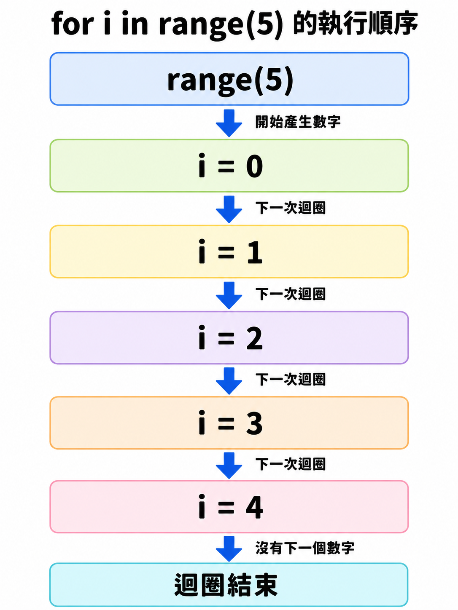
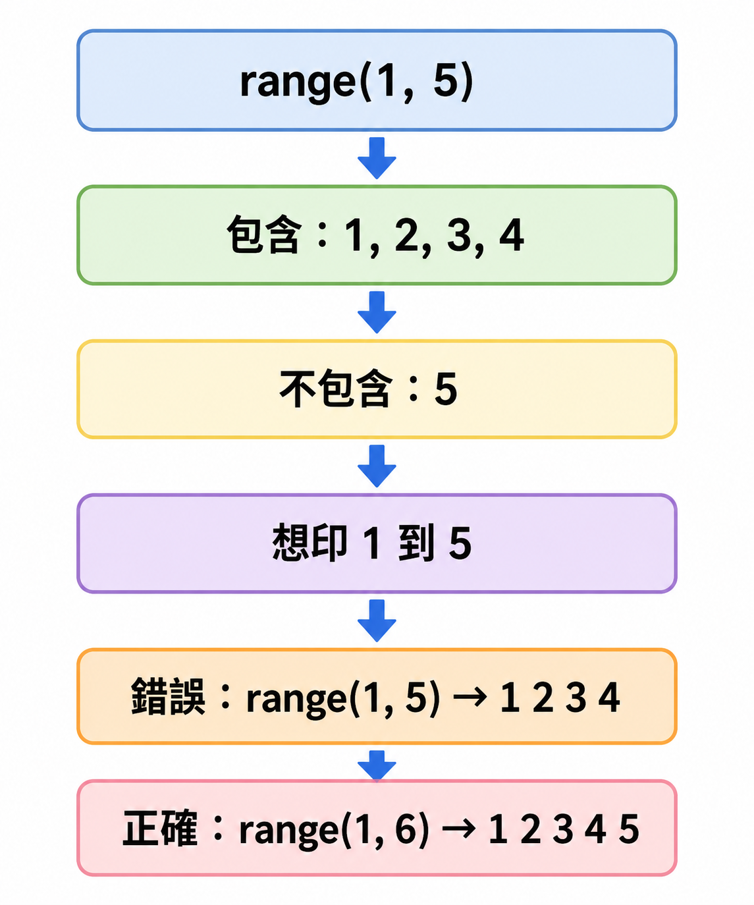
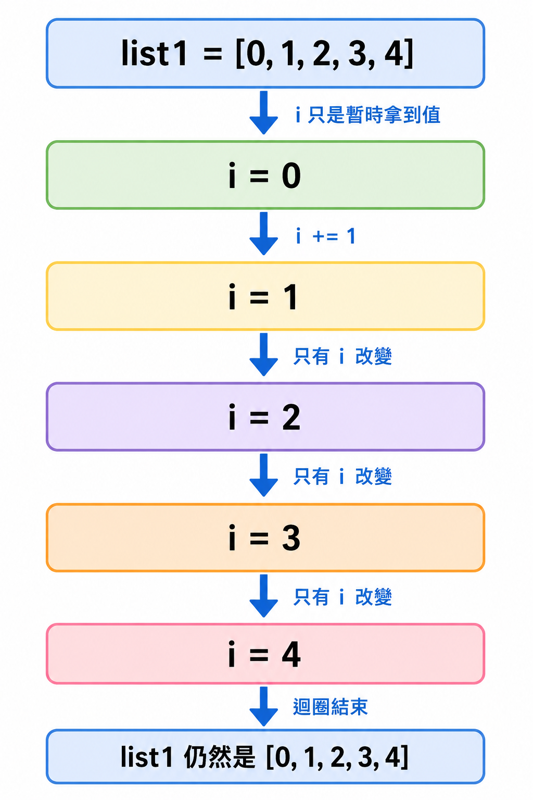
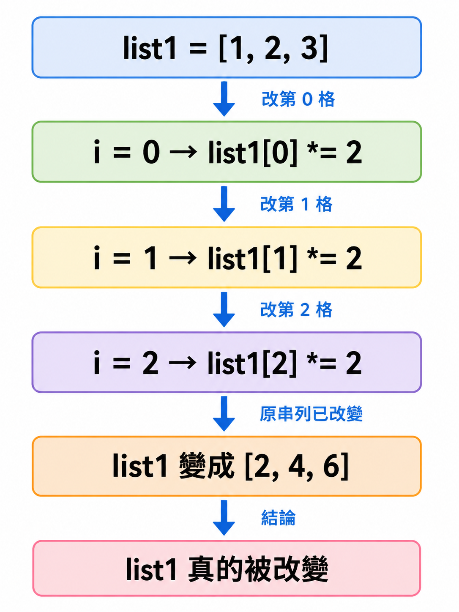
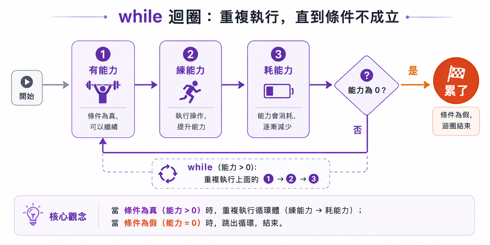
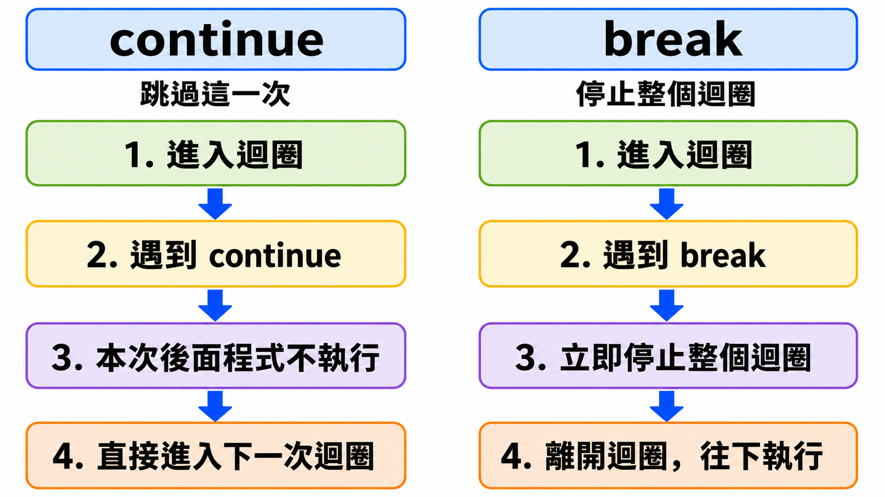

# Lesson 7: 迴圈 Loop

迴圈可以幫助我們把重複的動作寫得更簡潔，也是在 APCS 和基礎程式題目中非常常見的概念。

> 這堂課的重點：理解 `for` 迴圈、`while` 迴圈，以及 `continue`、`break` 的使用情境。
> 

---

## Section I. 今天要做什麼？

1. 認識什麼是迴圈。
2. 學習 `for` 迴圈和 `range()` 的用法。
3. 學習如何用迴圈讀取和修改串列。
4. 學習 `while` 迴圈的使用情境。
5. 認識 `continue` 和 `break`。
6. 完成幾題迴圈實作練習。

---

## Section II. 今天的學習方式

迴圈一開始看起來可能會有點抽象，因為程式會「重複執行同一段內容」。

不用一開始就把所有規則背起來，先做到：

1. 看得懂迴圈會重複執行哪一段程式。
2. 知道 `for` 適合已知次數的重複。
3. 知道 `while` 適合未知次數、需要條件控制的重複。
4. 可以用小例子追蹤變數如何改變。
5. 出錯時知道要檢查條件、縮排和變數更新。

---

## Section III. 今天會學到的內容

| 主題 | 你需要知道的事 |
| --- | --- |
| 迴圈 loop | 用來重複執行程式碼 |
| `for` 迴圈 | 常用於已知次數的重複 |
| `range()` | 產生一段整數範圍 |
| 串列迴圈 | 可以逐一取出 list 裡的元素 |
| `while` 迴圈 | 條件成立時就會一直重複 |
| `continue` | 跳過這一次迴圈 |
| `break` | 直接停止整個迴圈 |

---

## Section IV. 寫題目前的提醒

### 1. 先看懂「要重複什麼」

看到迴圈題目時，可以先問自己：

- 哪一件事情需要重複做？
- 要重複幾次？
- 有沒有停止條件？
- 每次重複時，變數會不會改變？

### 2. 注意縮排

在 Python 中，縮排會決定哪些程式碼屬於迴圈內部。

```python
for i in range(3):
    print(i)
print("done")
```

Result:

```
0
1
2
done
```

上面的 `print(i)` 在迴圈裡，所以會執行 3 次。`print("done")` 不在迴圈裡，所以只會執行 1 次。

### 3. `while` 迴圈要小心無限迴圈

如果 `while` 的條件一直是 `True`，程式就會一直跑下去。

```python
i = 0
while i < 3:
    print(i)
    i += 1
```

Result:

```
0
1
2
```

這裡一定要有 `i += 1`，否則 `i` 會一直是 `0`，條件 `i < 3` 會一直成立。

---

## Section V. 核心概念說明

### 1. 什麼是迴圈？

迴圈就是「重複」的概念。當我們需要做很多次相同或類似的事情時，可以使用迴圈讓程式更簡潔。

未使用迴圈：

```python
print(1)
print(1)
print(1)
print(1)
print(1)
```

Result:

```
1
1
1
1
1
```

使用迴圈：

```python
for i in range(5):
    print(1)
```

<p align="center">
  
</p>

Result:

```
1
1
1
1
1
```

這兩段程式的結果一樣，但使用迴圈可以避免重複寫很多行相同的程式。

---

### 2. `for` 迴圈

`for` 迴圈常用在「已知次數」的情況，也可以稱為「計次迴圈」。

基本格式：

```python
for i in range(5):
    print(i)
```

Result:

```
0
1
2
3
4
```

這裡的 `i` 是迴圈變數。每跑一次迴圈，`i` 會依序變成 `0`、`1`、`2`、`3`、`4`。

---

### 3. `range()` 的用法

`range()` 可以產生一段整數範圍。

<p align="center">
  
</p>

常見格式：

```python
range(start, end, step)
```

意思是：

- 從 `start` 開始。
- 到 `end` 前一個數字停止。
- 每次增加或減少 `step`。

如果只寫一個數字：

```python
for i in range(5):
    print(i, end=" ")
```

Result:

```
0 1 2 3 4
```

`range(5)` 代表從 `0` 到 `4`，不包含 `5`。

如果寫兩個數字：

```python
for i in range(1, 6):
    print(i, end=" ")
```

Result:

```
1 2 3 4 5
```

`range(1, 6)` 代表從 `1` 到 `5`，不包含 `6`。

如果寫三個數字：

```python
for i in range(2, 11, 2):
    print(i, end=" ")
```

Result:

```
2 4 6 8 10
```

`range(2, 11, 2)` 代表從 `2` 開始，每次加 `2`，直到 `10`。

---

### 4. 使用 `for` 迴圈輸出 1 到 100

```python
for i in range(1, 101):
    print(i, end=" ")
```

Result:

```
1 2 3 4 5 6 7 8 9 10 ... 100
```

實際執行時會印出 `1` 到 `100` 的所有數字。這裡使用 `101` 是因為 `range()` 的結尾數字不包含在範圍內。

---

### 5. 使用迴圈讀取串列 List

`for` 迴圈也可以直接讀取串列中的每一個元素。

```python
list1 = [0, 1, 2, 3, 4]

for i in list1:
    print(i, end=" ")
```

Result:

```
0 1 2 3 4
```

這裡的 `i` 會依序取得串列中的每個元素。

---

### 6. 注意：直接改變 `i` 不會修改原本的串列

<p align="center">
  
</p>

```python
list1 = [0, 1, 2, 3, 4]

for i in list1:
    i += 1
    print(i, end=" ")

print()
print(list1)
```

Result:

```
1 2 3 4 5
[0, 1, 2, 3, 4]
```

雖然 `i` 被加上 `1`，但原本的 `list1` 沒有被改變。

---

### 7. 如果要修改串列，要使用索引值

如果想要修改串列裡面的值，可以使用 `range(len(list1))` 取得索引值。

```python
list1 = [1, 2, 3, 4, 5]

for i in range(len(list1)):
    list1[i] *= 2

print(list1)
```

<p align="center">
  
</p>

Result:

```
[2, 4, 6, 8, 10]
```

這裡的 `i` 是索引值，所以 `list1[i]` 才能真正修改串列中的元素。

---

### 8. `while` 迴圈

<p align="center">
  
</p>

`while` 迴圈又稱為「條件迴圈」。只要條件是 `True`，就會一直重複執行。

```python
i = 0

while i < 3:
    print(i)
    i += 1
```

Result:

```
0
1
2
```

可以把 `while` 想像成一直重複判斷的 `if`。

---

### 9. 使用 `while` 判斷帳號密碼

```python
username = "hello"
password = "123"
login = False

while not login:
    username_input = input()
    password_input = input()

    if username_input == username and password_input == password:
        login = True
        print("已登入")
    else:
        print("錯誤")
```

這個程式會一直要求使用者輸入帳號密碼，直到輸入正確為止。

---

### 10. `continue` 和 `break`

在迴圈中：

- `continue`：跳過這一次迴圈，直接進入下一次。
- `break`：停止整個迴圈。

<p align="center">
  
</p>

```python
for i in range(20):
    if i % 4 == 0:
        continue
    elif i == 10:
        break
    print(i)
```

Result:

```
1
2
3
5
6
7
9
```

說明：

- 當 `i` 可以被 `4` 整除時，使用 `continue` 跳過。
- 當 `i == 10` 時，使用 `break` 停止整個迴圈。
- 因此 `10` 之後的數字都不會被印出。

---

## Section VI. 快速概念檢查

請先不要急著執行，先用眼睛看，猜猜看答案。

### Q1. `range(4)` 會跑幾次？

```python
for i in range(4):
    print(i)
```

Question:
你覺得結果會是什麼？

Answer:

```
0
1
2
3
```

Explanation:
`range(4)` 會從 `0` 到 `3`，不包含 `4`，所以總共跑 4 次。

---

### Q2. `range(1, 5)` 的結尾會包含 5 嗎？

```python
for i in range(1, 5):
    print(i, end=" ")
```

Question:
你覺得結果會是什麼？

Answer:

```
1 2 3 4
```

Explanation:
`range(1, 5)` 不包含 `5`，所以最後一個數字是 `4`。

---

### Q3. 這個串列會被改變嗎？

```python
nums = [1, 2, 3]

for x in nums:
    x += 10

print(nums)
```

Question:
你覺得結果會是什麼？

Answer:

```
[1, 2, 3]
```

Explanation:
`x` 只是暫時拿到串列中的值，改變 `x` 不會修改原本的 `nums`。

---

### Q4. `while` 會印到哪裡？

```python
i = 1

while i <= 3:
    print(i)
    i += 1
```

Question:
你覺得結果會是什麼？

Answer:

```
1
2
3
```

Explanation:
當 `i` 是 `1`、`2`、`3` 時條件成立。當 `i` 變成 `4` 時，`i <= 3` 不成立，迴圈停止。

---

### Q5. `break` 會做什麼？

```python
for i in range(5):
    if i == 3:
        break
    print(i)
```

Question:
你覺得結果會是什麼？

Answer:

```
0
1
2
```

Explanation:
當 `i == 3` 時，`break` 會停止整個迴圈，所以 `3` 不會被印出。

---

## Section VII. 程式閱讀練習

### 題目 1：追蹤 `for` 迴圈

```python
total = 0

for i in range(1, 4):
    total += i

print(total)
```

思考方式：

```
一開始 total = 0
i = 1 時，total = 0 + 1 = 1
i = 2 時，total = 1 + 2 = 3
i = 3 時，total = 3 + 3 = 6
```

所以答案是：

```
6
```

---

### 題目 2：追蹤串列修改

```python
nums = [2, 4, 6]

for i in range(len(nums)):
    nums[i] += 1

print(nums)
```

思考方式：

```
i = 0 時，nums[0] 從 2 變成 3
i = 1 時，nums[1] 從 4 變成 5
i = 2 時，nums[2] 從 6 變成 7
```

所以答案是：

```
[3, 5, 7]
```

---

### 題目 3：追蹤 `while` 迴圈

```python
x = 5

while x > 0:
    print(x)
    x -= 2
```

思考方式：

```
x = 5，條件成立，印出 5，x 變成 3
x = 3，條件成立，印出 3，x 變成 1
x = 1，條件成立，印出 1，x 變成 -1
x = -1，條件不成立，迴圈停止
```

所以答案是：

```
5
3
1
```

---

### 題目 4：追蹤 `continue`

```python
for i in range(1, 6):
    if i == 3:
        continue
    print(i)
```

思考方式：

```
i = 1，印出 1
i = 2，印出 2
i = 3，遇到 continue，跳過 print(i)
i = 4，印出 4
i = 5，印出 5
```

所以答案是：

```
1
2
4
5
```

---

## Section VIII. 實作練習 / 實作檢測題

請完成以下函式。這些題目建議使用 `return`，不要直接使用 `print()`。

### Q1. 回傳 1 到 n 的總和

完成函式：

```python
def q1_sum_to_n(n):
    #TODO: 回傳 1 + 2 + ... + n 的總和
    return None
```

Example:

```python
q1_sum_to_n(5)
```

應該回傳：

```
15
```

---

### Q2. 回傳 0 到 n-1 的串列

完成函式：

```python
def q2_range_list(n):
    #TODO: 回傳 [0, 1, 2, ..., n-1]
    return None
```

Example:

```python
q2_range_list(4)
```

應該回傳：

```
[0, 1, 2, 3]
```

---

### Q3. 計算偶數個數

完成函式：

```python
def q3_count_even(nums):
    #TODO: 回傳 nums 裡面偶數的數量
    return None
```

Example:

```python
q3_count_even([1, 2, 3, 4, 6])
```

應該回傳：

```
3
```

---

### Q4. 將串列中的數字全部乘以 2

完成函式：

```python
def q4_double_list(nums):
    #TODO: 回傳一個新的串列，裡面的數字都是原本的 2 倍
    return None
```

Example:

```python
q4_double_list([1, 2, 3])
```

應該回傳：

```
[2, 4, 6]
```

---

### Q5. 找出最大值

完成函式：

```python
def q5_find_max(nums):
    #TODO: 回傳 nums 裡面的最大值
    return None
```

Example:

```python
q5_find_max([3, 1, 8, 2])
```

應該回傳：

```
8
```

---

### Q6. 回傳所有正數

完成函式：

```python
def q6_positive_numbers(nums):
    #TODO: 回傳 nums 裡面所有大於 0 的數字
    return None
```

Example:

```python
q6_positive_numbers([-2, 0, 3, 5, -1])
```

應該回傳：

```
[3, 5]
```

---

### Q7. 使用 `while` 倒數

完成函式：

```python
def q7_countdown(n):
    #TODO: 回傳從 n 到 1 的串列
    return None
```

Example:

```python
q7_countdown(5)
```

應該回傳：

```
[5, 4, 3, 2, 1]
```

---

### Q8. 遇到負數就停止加總

完成函式：

```python
def q8_sum_until_negative(nums):
    #TODO: 從左到右加總，遇到負數就停止
    return None
```

Example:

```python
q8_sum_until_negative([3, 5, 2, -1, 10])
```

應該回傳：

```
10
```

---

### Q9. 找出使用者輸入數值的因數

完成函式：

```python
def q9_find_factors(n):
    #TODO: 回傳 n 的所有正因數，並存成串列
    return None
```

Example:

```python
q9_find_factors(12)
```

應該回傳：

```
[1, 2, 3, 4, 6, 12]
```

提示：如果 `n % i == 0`，代表 `i` 是 `n` 的因數。

---

### Q10. 計算字串中有幾個指定字母

完成函式：

```python
def q10_count_char(text, target):
    #TODO: 回傳 target 在 text 中出現幾次
    return None
```

Example:

```python
q10_count_char("banana", "a")
```

應該回傳：

```
3
```

---

## Section IX. 做題時可以使用的提示

### 1. 建立累加變數

```python
total = 0

for i in range(1, 6):
    total += i
```

當題目要「總和」時，通常會需要一個變數記錄目前加到哪裡。

---

### 2. 建立新的串列

```python
result = []

for x in [1, 2, 3]:
    result.append(x)
```

當題目要回傳多個結果時，可以先建立一個空串列，再用 `append()` 放入資料。

---

### 3. 判斷能不能整除

```python
if n % i == 0:
    # i 是 n 的因數
    pass
```

`%` 可以取得餘數。餘數是 `0`，代表可以整除。

---

### 4. 使用索引值修改串列

```python
nums = [1, 2, 3]

for i in range(len(nums)):
    nums[i] += 1
```

如果要真正修改串列裡面的元素，通常需要使用索引值。

---

### 5. `while` 記得更新變數

```python
i = 0

while i < 5:
    i += 1
```

如果忘記更新變數，`while` 可能會變成無限迴圈。

---

## Section X. 課後小練習

### 練習 1：回傳平方串列

寫一個函式：

```python
def practice_square_list(nums):
    return None
```

回傳一個新的串列，裡面每個數字都是原本數字的平方。

Example:

```python
practice_square_list([1, 2, 3])
```

應該回傳：

```
[1, 4, 9]
```

---

### 練習 2：計算大於 10 的數字有幾個

寫一個函式：

```python
def practice_count_over_10(nums):
    return None
```

回傳串列中大於 `10` 的數字個數。

Example:

```python
practice_count_over_10([3, 12, 18, 7])
```

應該回傳：

```
2
```

---

### 練習 3：回傳奇數串列

寫一個函式：

```python
def practice_odd_numbers(nums):
    return None
```

回傳串列中所有奇數。

Example:

```python
practice_odd_numbers([1, 2, 3, 4, 5])
```

應該回傳：

```
[1, 3, 5]
```

---

### 練習 4：判斷是否包含指定數字

寫一個函式：

```python
def practice_contains(nums, target):
    return None
```

如果 `target` 出現在 `nums` 中，回傳 `True`，否則回傳 `False`。

Example:

```python
practice_contains([2, 4, 6], 4)
```

應該回傳：

```
True
```

---

## Section XI. 重點複習

| 重點 | 說明 |
| --- | --- |
| `loop` | 重複執行程式碼 |
| `for` | 常用於已知次數的迴圈 |
| `range()` | 產生整數範圍，結尾不包含 |
| `list` | 可以用迴圈逐一讀取元素 |
| `range(len(list))` | 常用於用索引值修改串列 |
| `while` | 條件成立時就一直重複 |
| `continue` | 跳過這一次迴圈 |
| `break` | 停止整個迴圈 |

---

## Section XII. 常見錯誤提醒

### 1. 忘記 `range()` 不包含結尾

錯誤想法：

```python
for i in range(1, 5):
    print(i)
```

如果你想印出 `1` 到 `5`，這樣只會印到 `4`。

正確寫法：

```python
for i in range(1, 6):
    print(i)
```

---

### 2. 忘記縮排

錯誤寫法：

```python
for i in range(3):
print(i)
```

這樣會出現錯誤，因為 `print(i)` 應該放在迴圈裡面。

正確寫法：

```python
for i in range(3):
    print(i)
```

---

### 3. 在 `while` 迴圈中忘記更新變數

錯誤寫法：

```python
i = 0

while i < 3:
    print(i)
```

這樣 `i` 一直是 `0`，迴圈不會停止。

正確寫法：

```python
i = 0

while i < 3:
    print(i)
    i += 1
```

---

### 4. 以為改變迴圈變數會修改串列

錯誤寫法：

```python
nums = [1, 2, 3]

for x in nums:
    x *= 2

print(nums)
```

這樣不會修改原本的 `nums`。

正確寫法：

```python
nums = [1, 2, 3]

for i in range(len(nums)):
    nums[i] *= 2

print(nums)
```

---

## 補充提醒

寫迴圈題目時，可以先用小數字測試。例如題目要求處理 `1` 到 `100`，你可以先用 `1` 到 `5` 測試自己的想法是否正確。

迴圈最重要的是追蹤：

1. 目前變數是多少？
2. 條件是否成立？
3. 這一次迴圈做了什麼？
4. 下一次迴圈會變成什麼？