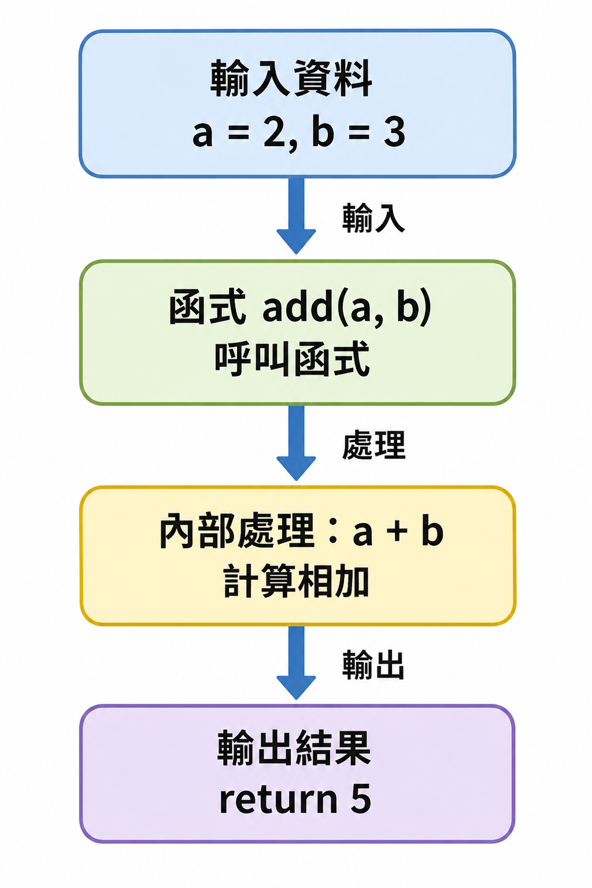
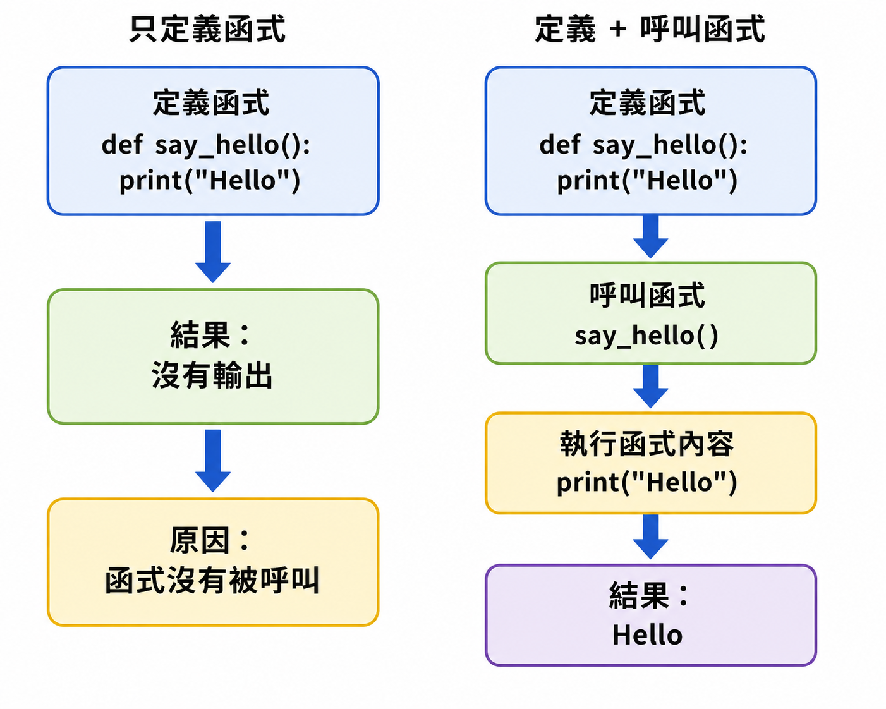
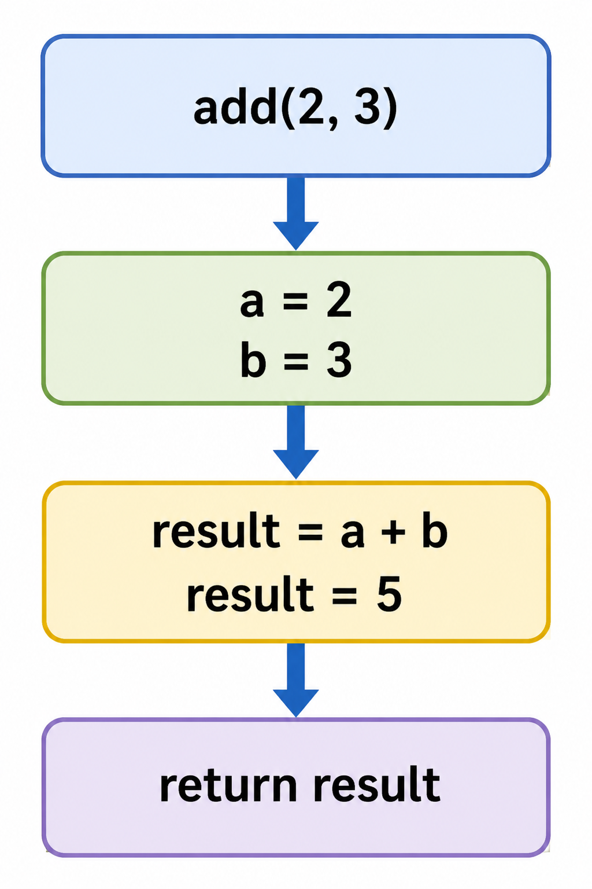
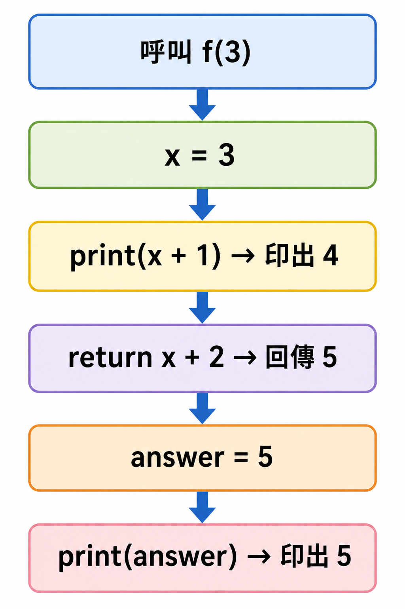

# Lesson 08: 函式 Function

函式可以把一段程式包起來，之後需要時再重複使用。

這個概念在寫比較長的程式、整理程式碼、做 APCS 題目時都很重要。

> 這堂課的重點：認識函式、建立函式、理解參數與 `return`，並學會使用模組中的函式。
> 

---

## Section I. 今天要做什麼？

1. 認識什麼是函式。
2. 學會使用 Python 內建函式。
3. 學會建立自己的自訂函式。
4. 理解參數（parameter）和回傳值（return）。
5. 認識外部模組與 `import`。
6. 練習把重複的程式整理成函式。

---

## Section II. 今天的學習方式

函式一開始看起來可能有一點抽象，但可以先把它想成一台小機器。

<p align="center">
  
</p>

一台機器通常會有：

1. 輸入資料。
2. 處理資料。
3. 輸出結果。

函式也是類似的概念。

不用一開始就把所有規則背起來，先做到：

1. 看得懂函式的基本寫法。
2. 知道什麼時候可以使用函式。
3. 知道 `return` 和 `print()` 不一樣。
4. 可以照著題目要求寫出簡單函式。
5. 可以使用一些常見的內建函式與模組函式。

---

## Section III. 今天會學到的內容

| 主題 | 你需要知道的事 |
| --- | --- |
| 函式 function | 把一段程式包起來，之後可以重複使用 |
| 參數 parameter | 函式接收的輸入資料 |
| 回傳值 return | 函式處理完後交回來的結果 |
| 內建函式 | Python 原本就提供的函式，例如 `print()`、`sum()` |
| 自訂函式 | 自己用 `def` 建立的函式 |
| 模組 module | 其他人或 Python 提供的工具包，例如 `math`、`random` |

---

## Section IV. 寫題目前的提醒

### 1. 先看懂函式要做什麼

寫函式前，先問自己：

- 函式名稱是什麼？
- 函式會收到哪些資料？
- 函式中間要做什麼處理？
- 最後要 `return` 什麼結果？

例如題目說：「寫一個函式，輸入兩個數字，回傳它們的和。」

你可以先整理成：

```
輸入：兩個數字 a, b
處理：a + b
輸出：加總結果
```

---

### 2. 注意 `return` 和 `print()` 不一樣

`print()` 是把結果印在畫面上。

`return` 是把結果交回給呼叫函式的地方。

```python
def add(a, b):
    return a + b

answer = add(3, 5)
print(answer)
```

Result:

```
8
```

這裡 `add(3, 5)` 會回傳 `8`，所以 `answer` 會變成 `8`。

---

### 3. 函式不會自己執行

定義函式只是「建立工具」，還沒有真的使用它。

<p align="center">
  
</p>

```python
def say_hello():
    print("Hello")
```

這段程式只定義了函式，不會印出任何東西。

如果要執行函式，需要呼叫它：

```python
def say_hello():
    print("Hello")

say_hello()
```

Result:

```
Hello
```

---

### 4. 注意縮排

函式裡面的程式需要縮排。

```python
def square(x):
    return x * x
```

如果沒有縮排，Python 會看不懂哪些程式屬於函式內部。

---

## Section V. 核心概念說明

### 1. 什麼是函式？

函式可以想成一台小機器：

```
輸入 input → 處理 process → 輸出 output
```

例如：輸入兩個數字，函式幫我們相加，最後回傳答案。

```python
def add(a, b):
    result = a + b
    return result

print(add(2, 3))
```

Result:

```
5
```

<p align="center">
  
</p>

在這個例子中：

| 部分 | 說明 |
| --- | --- |
| `def add(a, b):` | 建立一個叫做 `add` 的函式 |
| `a, b` | 函式收到的參數 |
| `result = a + b` | 函式內部的處理 |
| `return result` | 把結果回傳出去 |
| `add(2, 3)` | 呼叫函式並提供資料 |

---

### 2. 函式的基本寫法

```python
def function_name(parameter1, parameter2):
    # process
    return output
```

實際例子：

```python
def double(x):
    return x * 2

print(double(6))
```

Result:

```
12
```

這個函式收到一個數字 `x`，然後回傳 `x * 2`。

---

### 3. 沒有參數的函式

有些函式不需要輸入資料。

```python
def say_hi():
    return "Hi"

print(say_hi())
```

Result:

```
Hi
```

呼叫沒有參數的函式時，括號還是要寫：

```python
say_hi()
```

---

### 4. 有多個參數的函式

函式可以接收多個參數。

```python
def multiply(a, b):
    return a * b

print(multiply(4, 5))
```

Result:

```
20
```

這裡 `a` 會拿到 `4`，`b` 會拿到 `5`。

---

### 5. 內建函式 built-in functions

Python 有很多已經幫我們準備好的函式，這些叫做內建函式。

```python
numbers = [3, 8, 2, 10]

print(max(numbers))
print(min(numbers))
print(sum(numbers))
```

Result:

```
10
2
23
```

常見內建函式：

| 函式 | 功能 |
| --- | --- |
| `abs(value)` | 取絕對值 |
| `max(a, b, c)` | 取最大值 |
| `min(a, b, c)` | 取最小值 |
| `pow(a, b)` | 計算 a 的 b 次方 |
| `round(a)` | 四捨五入到最接近的整數 |
| `sum(list)` | 計算串列總和 |
| `type(a)` | 查看資料型態 |
| `len(list)` | 查看長度 |

---

### 6. 自訂函式 custom function

自訂函式就是自己創造一個函式。

```python
def plus(a, b):
    answer = a + b
    return answer

print(plus(1, 4))
```

Result:

```
5
```

使用自訂函式的好處：

1. 可以避免重複寫相同程式。
2. 可以讓程式更容易閱讀。
3. 可以把大問題拆成小問題。
4. 可以比較容易測試每個功能是否正確。

---

### 7. 外部模組與 `import`

模組（module）可以想成 Python 的工具箱。

如果要使用模組，需要先 `import`。

```python
import math

print(math.sqrt(16))
```

Result:

```
4.0
```

這裡 `math.sqrt(16)` 的意思是：

```
使用 math 模組裡面的 sqrt 函式
```

常見模組：

| 模組名稱 | 功能 |
| --- | --- |
| `sys` | 與系統互動相關功能 |
| `math` | 數學函式 |
| `random` | 產生隨機數 |
| `time` | 時間相關功能 |
| `numpy` | 資料處理相關功能，屬於第三方套件 |

---

### 8. 使用 `as` 幫模組取別名

有時候模組名稱比較長，可以用 `as` 取短一點的名字。

```python
import random as r

number = r.randint(1, 10)
print(number)
```

Result:

```
每次執行可能不同，會是 1 到 10 之間的整數
```

注意：`random.randint(1, 10)` 需要兩個數字，代表隨機整數的範圍。

---

### 9. 使用函式製作簡單計算機

我們可以把加減乘除拆成不同函式。

```python
def plus(a, b):
    return a + b

def minus(a, b):
    return a - b

def multiply(a, b):
    return a * b

def divide(a, b):
    return a / b

print(plus(3, 2))
print(minus(3, 2))
print(multiply(3, 2))
print(divide(3, 2))
```

Result:

```
5
1
6
1.5
```

這樣寫的好處是：每一個函式只負責一件事情，程式比較清楚。

---

## Section VI. 快速概念檢查

請先不要急著執行，先用眼睛看，猜猜看答案。

### Q1. 函式回傳什麼？

```python
def f(x):
    return x + 1

print(f(5))
```

Question:
你覺得結果會是什麼？

Answer:

```
6
```

Explanation:
`x` 拿到 `5`，所以 `x + 1` 是 `6`。

---

### Q2. 函式沒有被呼叫會怎樣？

```python
def hello():
    print("Hello")
```

Question:
這段程式會印出什麼？

Answer:

```

```

Explanation:
這段程式只定義函式，沒有呼叫 `hello()`，所以不會印出任何內容。

---

### Q3. 多個參數

```python
def f(a, b):
    return a * b + 1

print(f(2, 5))
```

Question:
你覺得結果會是什麼？

Answer:

```
11
```

Explanation:
`a` 是 `2`，`b` 是 `5`，所以 `2 * 5 + 1 = 11`。

---

### Q4. `return` 後面的程式

```python
def test():
    return 10
    return 20

print(test())
```

Question:
你覺得結果會是什麼？

Answer:

```
10
```

Explanation:
函式執行到第一個 `return` 就會結束，所以後面的 `return 20` 不會被執行。

---

### Q5. 內建函式

```python
numbers = [4, 1, 9, 2]

print(max(numbers))
print(sum(numbers))
```

Question:
你覺得結果會是什麼？

Answer:

```
9
16
```

Explanation:
`max(numbers)` 會找最大值，`sum(numbers)` 會計算總和。

---

## Section VII. 程式閱讀練習

### 題目 1：基本函式呼叫

```python
def add_two(x):
    return x + 2

a = add_two(3)
b = add_two(a)
print(b)
```

思考方式：

```
add_two(3) 回傳 5，所以 a 是 5。
add_two(a) 等於 add_two(5)，回傳 7，所以 b 是 7。
```

所以答案是：

```
7
```

---

### 題目 2：函式中的變數

```python
def change(x):
    x = x + 10
    return x

x = 5
print(change(x))
print(x)
```

思考方式：

```
change(x) 會把 5 傳進函式，函式內部回傳 15。
但是函式外面的 x 還是 5。
```

所以答案是：

```
15
5
```

---

### 題目 3：`print()` 和 `return`

<p align="center">
  
</p>

```python
def f(x):
    print(x + 1)
    return x + 2

answer = f(3)
print(answer)
```

思考方式：

```
呼叫 f(3) 時，函式裡面先 print(4)。
接著 return 5，所以 answer 變成 5。
最後 print(answer) 印出 5。
```

所以答案是：

```
4
5
```

---

### 題目 4：使用模組

```python
import math

x = math.sqrt(25)
print(x)
```

思考方式：

```
math.sqrt(25) 是計算 25 的平方根。
結果是 5.0，因為 sqrt 回傳浮點數。
```

所以答案是：

```
5.0
```

---

## Section VIII. 實作練習 / 實作檢測題

請完成下面函式。這一區不提供完整解答，請先自己試著寫。

### Q1. 回傳兩數相加

完成函式：

```python
def q1_add(a, b):
    #TODO: 回傳 a + b
    return None
```

Example:

```python
q1_add(3, 5)
```

應該回傳：

```
8
```

---

### Q2. 回傳平方

完成函式：

```python
def q2_square(x):
    #TODO: 回傳 x 的平方
    return None
```

Example:

```python
q2_square(6)
```

應該回傳：

```
36
```

---

### Q3. 判斷是否為偶數

完成函式：

```python
def q3_is_even(x):
    #TODO: 如果 x 是偶數，回傳 True，否則回傳 False
    return None
```

Example:

```python
q3_is_even(8)
```

應該回傳：

```
True
```

---

### Q4. 回傳串列最大值

完成函式：

```python
def q4_max_number(numbers):
    #TODO: 回傳 numbers 裡面的最大值
    return None
```

Example:

```python
q4_max_number([3, 9, 1, 5])
```

應該回傳：

```
9
```

---

### Q5. 回傳串列總和

完成函式：

```python
def q5_sum_numbers(numbers):
    #TODO: 回傳 numbers 裡面所有數字的總和
    return None
```

Example:

```python
q5_sum_numbers([1, 2, 3, 4])
```

應該回傳：

```
10
```

---

### Q6. 回傳兩數中較大的數

完成函式：

```python
def q6_bigger(a, b):
    #TODO: 回傳 a 和 b 中比較大的數
    return None
```

Example:

```python
q6_bigger(7, 12)
```

應該回傳：

```
12
```

---

### Q7. 攝氏轉華氏

完成函式：

```python
def q7_c_to_f(c):
    #TODO: 將攝氏溫度 c 轉成華氏溫度
    return None
```

Example:

```python
q7_c_to_f(0)
```

應該回傳：

```
32.0
```

提示：華氏溫度公式是 `c * 9 / 5 + 32`。

---

### Q8. 回傳字串長度

完成函式：

```python
def q8_string_length(s):
    #TODO: 回傳字串 s 的長度
    return None
```

Example:

```python
q8_string_length("hello")
```

應該回傳：

```
5
```

---

### Q9. 簡單計算機

完成函式：

```python
def q9_calculator(a, op, b):
    #TODO: op 是 '+', '-', '*', '/' 其中一種
    # 根據 op 回傳 a 和 b 的運算結果
    return None
```

Example:

```python
q9_calculator(10, "+", 3)
```

應該回傳：

```
13
```

---

### Q10. 回傳絕對值差

完成函式：

```python
def q10_abs_difference(a, b):
    #TODO: 回傳 a 和 b 相差多少
    return None
```

Example:

```python
q10_abs_difference(3, 10)
```

應該回傳：

```
7
```

---

## Section IX. 做題時可以使用的提示

### 1. 建立函式的基本格式

```python
def function_name(x):
    return x
```

函式名稱後面要有括號，括號裡面可以放參數。

---

### 2. 使用 `return`

```python
def add(a, b):
    return a + b
```

如果題目要求「回傳」，通常就要使用 `return`，不要只寫 `print()`。

---

### 3. 使用 `if`

```python
def check(x):
    if x > 0:
        return "positive"
    else:
        return "not positive"
```

函式裡面也可以使用條件判斷。

---

### 4. 使用內建函式

```python
max([3, 5, 1])
min([3, 5, 1])
sum([3, 5, 1])
len([3, 5, 1])
```

這些函式可以幫你快速處理資料。

---

### 5. 使用 `%` 判斷偶數

```python
x % 2 == 0
```

如果一個數除以 2 的餘數是 0，代表它是偶數。

---

### 6. 使用 `import`

```python
import math

math.sqrt(9)
```

要使用模組裡面的函式，通常要寫成：

```
模組名稱.函式名稱()
```

---

## Section X. 課後小練習

### 練習 1：回傳三個數的平均

寫一個函式：

```python
def average_three(a, b, c):
    return None
```

回傳三個數字的平均值。

Example:

```python
average_three(3, 6, 9)
```

應該回傳：

```
6.0
```

---

### 練習 2：判斷是否及格

寫一個函式：

```python
def is_pass(score):
    return None
```

如果 `score` 大於或等於 60，回傳 `True`，否則回傳 `False`。

Example:

```python
is_pass(75)
```

應該回傳：

```
True
```

---

### 練習 3：回傳名字問候語

寫一個函式：

```python
def greet(name):
    return None
```

回傳 `"Hello, name!"` 的格式。

Example:

```python
greet("Amy")
```

應該回傳：

```
Hello, Amy!
```

---

### 練習 4：回傳串列第一個元素

寫一個函式：

```python
def first_item(items):
    return None
```

回傳串列中的第一個元素。

Example:

```python
first_item([10, 20, 30])
```

應該回傳：

```
10
```

---

### 練習 5：使用函式整理程式

請寫四個函式：

```python
def add(a, b):
    return None

def subtract(a, b):
    return None

def multiply(a, b):
    return None

def divide(a, b):
    return None
```

分別回傳加、減、乘、除的結果。

---

## Section XI. 重點複習

| 重點 | 說明 |
| --- | --- |
| `def` | 用來建立函式 |
| parameter | 函式收到的輸入資料 |
| `return` | 把結果回傳出去 |
| `print()` | 把資料印在畫面上 |
| built-in function | Python 已經提供的函式 |
| custom function | 自己建立的函式 |
| module | 可以匯入使用的工具包 |
| `import` | 匯入模組 |
| `module.function()` | 使用模組裡面的函式 |

---

## Section XII. 常見錯誤提醒

### 1. 只定義函式，沒有呼叫函式

Wrong:

```python
def hello():
    print("Hello")
```

這樣只是在建立函式，還沒有真的執行。

Correct:

```python
def hello():
    print("Hello")

hello()
```

---

### 2. 忘記寫 `return`

Wrong:

```python
def add(a, b):
    answer = a + b
```

這個函式沒有把答案回傳出去。

Correct:

```python
def add(a, b):
    answer = a + b
    return answer
```

---

### 3. 把 `print()` 當成 `return`

Wrong:

```python
def add(a, b):
    print(a + b)
```

如果題目要求「回傳結果」，只用 `print()` 可能不符合題目要求。

Correct:

```python
def add(a, b):
    return a + b
```

---

### 4. 函式名稱拼錯

Wrong:

```python
def plus(a, b):
    return a + b

print(pluss(1, 2))
```

`plus` 和 `pluss` 是不同名字，Python 會找不到函式。

Correct:

```python
def plus(a, b):
    return a + b

print(plus(1, 2))
```

---

### 5. 模組函式少寫模組名稱

Wrong:

```python
import math

print(sqrt(16))
```

如果只寫 `import math`，使用裡面的函式時要加上 `math.`。

Correct:

```python
import math

print(math.sqrt(16))
```

---

### 6. `return` 後面的程式不會執行

Wrong:

```python
def test():
    return 1
    print("Hello")
```

函式遇到 `return` 就會結束，所以 `print("Hello")` 不會被執行。

Correct:

```python
def test():
    print("Hello")
    return 1
```

---

## Section XIII. 小提醒

函式不是新的「困難語法」，而是幫助我們整理程式的方法。

當程式越來越長時，函式可以幫我們把大問題切成小問題：

```
大問題：做一個計算機
小問題 1：加法
小問題 2：減法
小問題 3：乘法
小問題 4：除法
小問題 5：根據符號選擇功能
```

之後寫比較大的題目時，先想想：

> 我能不能把這個問題拆成幾個小函式？
>